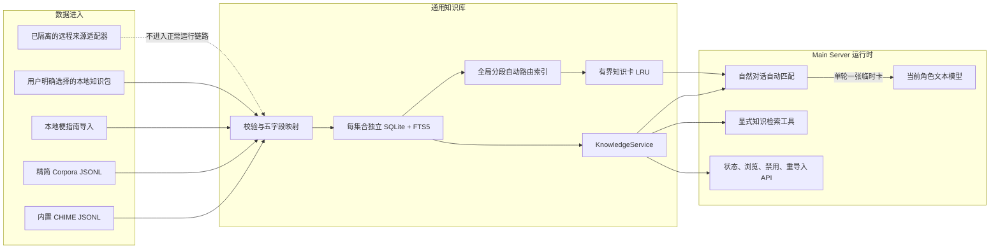
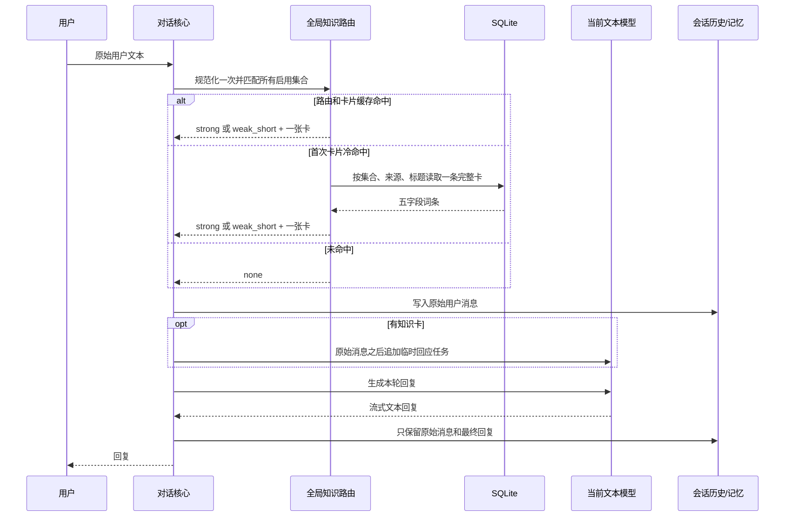

# 通用知识库功能实现与验收汇报

> 示例业务域：公共梗知识库
> 报告日期：2026-07-27
> 当前分支：`codex/moegirl-knowledge-continue`
> 总体结论：通用知识库的存储、检索、自动递卡、数据包、管理接口和多知识库路由已经完成；梗库与精简 Corpora 演示库已验证真实多集合隔离，固定回应质量回归已改善严肃语境退出，但少数梗仍会得到偏通用的回复。

## 1. 项目目标与结论

本轮建设不是单独增加一个“萌娘百科查询工具”，而是以梗知识为首个业务样本，形成一套可被未来术语库、作品知识库和轻量游戏知识卡复用的本地通用知识库能力。

已经达到的核心目标：

- 公共知识和用户记忆严格分离；
- 一个稳定的五字段知识卡契约；
- SQLite + FTS5 的本地存储和显式检索；
- 用户自然说话时进行本地词面匹配；
- 单轮最多向角色递送一张临时知识卡；
- 临时知识卡不进入对话历史、记忆文件或后续轮次；
- 支持多个知识库统一路由，而不是逐库重复扫描用户文本；
- 支持本地知识包的校验、替换导入和自动上下文开关；
- Main Server 托管启动、状态、管理和关闭流程，不新增服务；
- 正常对话中的知识检索热路径不联网、不调用第二个模型、不依赖 TTS。

当前不能宣称完全解决的问题：

- 模型即使收到正确梗卡，也可能给出偏通用的回应；
- Corpora 演示集合当前只开放通用服务层的显式查询与管理，尚未接入角色工具或随机生成产品入口；
- 管理后端接口已经存在，但尚未建设完整的可视化管理页面；
- 梗8和萌娘百科适配器已经与运行时隔离，未知梗自动抓取不属于当前可用功能；
- 五字段适合“对话知识卡”，不适合游戏数值计算、掉落关系或配装推导等结构化业务。

因此，当前状态应定义为：

> 通用知识库基础设施完成，梗知识样本完成并可用；自动递卡的工程链路通过验收，角色回应效果部分达标。

## 2. 当前技术架构



架构上有两个相互独立的查询路径：

1. **自动搭话路径**：只做标题、可信别名和固定引用的本地匹配，用于当前回复。
2. **显式查询路径**：通过 FTS5/BM25 检索标题、术语、标签、摘要和正文，用于用户明确询问知识时返回短卡。

自动匹配不会因为正文相关、标签相似或 BM25 弱命中而给角色递卡。这一边界用于防止普通句子触发错误知识。

## 3. 五字段知识卡契约

每条业务知识仅保留五个字段：

```text
title / terms / tags / summary / content
```

| 字段 | 职责 | 自动搭话是否使用 |
| --- | --- | --- |
| `title` | 规范标题 | 是 |
| `terms.alias` | 来源明确给出的同义名称或可靠规范变体 | 是 |
| `terms.recognition` | 固定引用、典型说法或可直接识别的完整片段 | 是 |
| `tags` | `source:*`、`type:*`、`risk:*`、`quality:*` 等分类 | 只用于资格、风险和回应方向，不按标签触发 |
| `summary` | 简短含义 | 命中后写入临时卡 |
| `content` | 来源已有的出处、例句和补充信息 | 只抽取一条例句写入临时卡；显式查询可检索 |

来源主页、默认许可证、获取方式和版本属于来源级配置，不在每条词条中重复保存。同步健康状态保存在来源级状态文件；禁用规则按来源和标题保存在 `catalog.override.json`。

这一契约可以直接复用于通用术语、作品设定和轻量游戏知识卡。需要精确数值、关系图或计算的数据，应使用业务专用表，不扩张通用知识卡字段。

## 4. 自动对话递卡链路



### 4.1 强匹配

`strong` 模式包括：

- 至少三个规范化字符的标题；
- 至少三个规范化字符的可信别名；
- 至少两个字符的固定引用或典型说法。

强匹配的临时任务明确告诉模型：上一条用户消息正在使用已确认知识；应先顺着隐含语气回应，不要先否认、安慰、解释或询问是不是梗。

### 4.2 两字弱提示

`weak_short` 只在强匹配失败后启用，并且候选必须同时满足：

- 标题或别名规范化长度恰好为两个字符；
- 来源为 CHIME；
- 有 `type:*` 标签；
- 来源内容存在至少一条例句；
- 没有被禁用；
- 没有 `quality:stale-usage`；
- 词面连续出现在用户原话中。

弱提示要求模型先判断整句是否确实使用网络含义。医疗、安全、法律、财务或其他严肃字面语境必须忽略该卡。

### 4.3 临时任务生命周期

命中后，用户原话仍按原样进入历史。临时知识任务作为紧邻其后的本次请求指令传给模型，并在最外层清理逻辑中按对象身份移除。

正常完成、模型异常、用户取消、中断和工具调用后的继续生成都使用同一清理边界。临时任务不是用户消息，不写入：

- `recent.json`；
- `facts.json`；
- `reflections.json`；
- `persona.json`；
- 公共知识库正文；
- INFO 日志正文。

## 5. 多知识库查询减压设计

早期的逐库方案需要对同一用户文本重复规范化，并依次打开多个 SQLite 数据库。3 个知识库、每库 10,000 条时，优化前无命中约为 114.8 ms，末库命中约为 147.6 ms，每轮需要访问 3 个数据库。

当前实现改为一个逻辑上的全局路由器，内部由每个知识库独立、可替换的词典分段组成：

```text
用户文本
→ 只规范化一次
→ 所有集合的内存路由分段
→ 全局稳定排序
→ 最多选择一个 RouteRecord
→ 有界 LRU 获取完整知识卡
→ 必要时只访问命中集合的一次 SQLite
```

主要减压措施：

- 路由记录只保存集合、来源、标题、强弱词项、优先级和修订号，不把摘要或正文常驻路由索引；
- 完整知识卡 LRU 上限为 256；
- 路由状态缓存上限为 16；
- 热命中不访问 SQLite；
- 路由预热后未命中不访问 SQLite；
- 首次冷命中最多读取一次 SQLite；
- 写入只标记对应数据库为 dirty；
- 后台刷新只重建变更集合的分段，不重建所有知识库；
- 刷新期间继续使用旧的不可变快照，完成后原子发布新快照；
- 单个知识库损坏或加载失败时，其他知识库仍可参与路由；
- SQLite schema 初始化结果按数据库文件身份缓存，原子替换数据库后会重新初始化。

全局选择规则保持确定性：强匹配优先于弱匹配，其次比较匹配长度/分数、集合优先级、标题和集合标识。无论启用多少知识库，一轮仍只返回一张卡。

## 6. 通用接口与主要函数

项目代码应从 `knowledge.api` 使用稳定接口；`moegirl_knowledge` 下的旧名称只作为兼容入口。

### 6.1 服务接口

| 函数 | 用途 |
| --- | --- |
| `open_knowledge(knowledge_root)` | 打开本地知识服务，不启动任务、不访问网络 |
| `KnowledgeService.search()` | 对指定集合执行显式 FTS/BM25 检索 |
| `KnowledgeService.match_turn()` | 对单个集合执行强/弱词面匹配 |
| `KnowledgeService.build_turn_context()` | 跨启用集合选择一张卡并渲染临时任务 |
| `KnowledgeService.list_entries()` | 分页浏览词条 |
| `KnowledgeService.get_entry()` | 按来源与标题取得完整五字段词条 |
| `KnowledgeService.set_entry_disabled()` | 禁用或恢复词条，并刷新路由 |
| `KnowledgeService.get_status()` | 返回集合数据库状态 |
| `KnowledgeService.count_entries()` | 统计集合或来源条目数 |
| `KnowledgeService.import_pack()` | 导入用户明确选择的本地数据包 |
| `KnowledgeService.list_packs()` | 列出已安装数据包及自动上下文状态 |
| `KnowledgeService.set_pack_auto_context()` | 独立启用或关闭某个知识包的自动递卡 |
| `KnowledgeService.refresh_routing_index()` | 同步或后台刷新路由快照 |

### 6.2 路由与存储接口

| 函数 | 用途 |
| --- | --- |
| `KnowledgeRoutingState.match()` | 在全部允许集合中选择一个稳定路由结果 |
| `KnowledgeRoutingState.get_card()` | 从 LRU 或命中数据库取得完整词条 |
| `KnowledgeRoutingState.mark_database_dirty()` | 标记单个数据库需要刷新 |
| `KnowledgeRoutingState.refresh_in_background()` | 合并写入后的后台刷新请求 |
| `notify_database_changed()` | 存储提交后通知所有相关路由状态 |
| `KnowledgeStore.upsert_many()` | 在事务中批量新增或更新词条及 FTS |
| `KnowledgeStore.replace_source()` | 原子替换一个来源的数据切片 |
| `KnowledgeStore.load_routing_entries()` | 在同一事务中读取修订号和路由词条 |
| `KnowledgeStore.query_fts()` | 执行显式全文检索 |
| `KnowledgeStore.integrity_ok()` | 检查 SQLite 完整性 |

### 6.3 本地知识包

知识包由用户明确选择导入，不扫描目录、不联网、不执行代码。包元数据只保存一次，词条仍使用五字段契约。

主要边界：

- 社区来源标签强制派生为 `source:community.<pack_id>`，不能伪装内置来源；
- 导入时原子替换该包对应的来源切片；
- 新包默认只参与显式查询；
- 只有用户明确启用后才参与自动递卡；
- 数据包不能携带 Python、提示词、匹配策略、网络配置或模型配置。

## 7. 梗知识库样本实现

### 7.1 当前真实数据

2026-07-27 主程序实测状态：

| 来源 | 条目数 | 获取方式 | 运行状态 |
| --- | ---: | --- | --- |
| CHIME | 1,458 | 已移至 `codex/knowledge-datasets` | 不再随功能分支启动导入 |
| 梗指南 | 194 | 用户提供资料的本地导入 | available |
| 萌娘百科 | 5 | 早期已入库的本地条目 | available，远程适配器隔离 |
| 梗8 | 0 | 无运行时采集 | empty，远程适配器隔离 |
| **合计** | **1,657** |  | SQLite 完整性通过 |

CHIME 使用一条记录一行的 `chime_full.jsonl`，固定 1,458 行。资产现保存在
`codex/knowledge-datasets`，不进入功能分支的 wheel。文件 SHA-256 为：

```text
e7eaea229d6d8a7af0c3273067bca8220d89c85bc1865b7907cc397e279e8e75
```

当前功能分支不再自动加载该资产；运行时知识通过本地知识包安装。

### 7.2 显式工具

模型可见的内置工具已收敛为 `query_public_knowledge(query, collection="all", mode="lookup", limit=3)`，使用同一个 `KnowledgeService`：

- 可跨梗库与 Corpora 检索，或用 `mode=sample` 从集合明确允许的 `dataset:*` 标签中抽取素材；
- 最多返回三张短卡，展示摘要、必要详情、分类、风险和来源名称；
- 不返回整篇正文；
- 本地未命中立即返回；
- 不触发百科、爬虫或网络搜索；
- 工具失败不会中断普通对话。

模型可见工具只注册这一项，不同时暴露梗库、Corpora 或未来知识库各自的专用工具。旧梗查询函数只保留内部兼容导出。

### 7.3 管理接口

Main Server 已提供：

```text
GET  /api/moegirl-knowledge/status
GET  /api/moegirl-knowledge/entries
GET  /api/moegirl-knowledge/entry
POST /api/moegirl-knowledge/entry/disabled
```

查询接口支持分页、来源筛选、生产检索诊断和五字段详情。禁用词条使用现有 CSRF + Origin 校验。

### 7.4 Corpora 精简演示集合

第二个真实集合来自 [dariusk/corpora](https://github.com/dariusk/corpora)，固定到提交 `cf30ca27ab176b63623af1ddcfa2447ac07305ba`，使用其 CC0 数据。本项目不打包完整上游仓库，只保留 229 条、约 119 KiB 的确定性 JSONL 子集：

| 数据 | 条目数 |
| --- | ---: |
| 希腊神话人物 | 31 |
| 塔罗牌解释 | 78 |
| 常见动物 | 24 |
| 水果与蔬菜 | 24 |
| 热门电影 | 24 |
| Web 颜色 | 16 |
| 职业 | 16 |
| 情绪词 | 16 |
| **合计** | **229** |

人格问卷因包含宗教、政治倾向及低复用问题而整体排除；其余大词表、姓名、政治人物、电视节目全集和噪声较高的数据同样未打包。构建脚本能从固定上游版本确定性重建该子集，加载器校验 SHA-256、229 行、五字段结构、来源标签和重复标题。

该集合写入独立的 `<knowledge_dir>/corpora/knowledge.db`。神话人物、塔罗牌和电影等具体名称使用现有全局路由自动递送一张临时知识卡；动物、食物、颜色、职业和情绪等常用素材词不参加普通词面自动匹配，避免 `cat`、`blue`、`calm` 等日常表达误触发。

明确的抽取请求由消费层做极窄的“请求动作 + 素材主题”判断，例如“抽 + 塔罗”或“给我一个 + NPC 职业”，随后从集合允许的标签同步读取一条本地卡。该路径不增加模型调用、不联网，也不改变 SQLite 或路由地基；主动工具仍可用于模型明确发起的跨库查询与素材抽取。

## 8. 测试与性能结果

### 8.1 自动化回归

最终核心知识库回归结果：

```text
89 passed in 30.29s
```

同时通过：

- Ruff；
- `scripts/check_module_layering.py knowledge`；
- `scripts/check_async_blocking.py knowledge app/main_server/moegirl_knowledge_runtime.py`；
- `scripts/check_api_trailing_slash.py main_routers/moegirl_knowledge_router.py`。

覆盖范围包括五字段存储、FTS、导入幂等、损坏库降级、强弱匹配、禁用、临时任务清理、知识包隔离、多集合冲突、稳定排序、缓存上限、单库损坏隔离、数据库替换和后台刷新；同时覆盖 Corpora 资产摘要与行数、独立导入、显式检索、管理禁用和自动搭话隔离。

跨库同名词条消歧修复后，知识库相关扩展回归为 `88 passed`。新增覆盖相同强度与词面下的领域提示、无提示优先级回退、提示不能独立触发、强匹配不被弱提示覆盖、较长词面优先及拉丁提示词边界。

### 8.2 5 × 10,000 条极限预热测试

结果：PASS。

| 指标 | 结果 |
| --- | ---: |
| 路由构建 | 1,538.9 ms |
| 路由 RSS 增量 | 51.5 MiB |
| 冷命中 | 5.90 ms |
| 热命中 p95 | 0.15 ms |
| 未命中 p95 | 0.02 ms |
| 显式检索 p95 | 30.94 ms |

### 8.3 3 × 10,000 条、15 分钟混合压力测试

配置为 4 个读取线程和 1 个串行写入线程，持续 900.3 秒。

| 指标 | 结果 |
| --- | ---: |
| 总操作数 | 58,284 |
| 错误数 | 0 |
| 路由构建 | 1,829.7 ms |
| 路由 RSS 增量 | 30.7 MiB |
| 预热后 RSS 增量 | 26.9 MiB |
| 热命中 p95 | 31.16 ms |
| 冷命中 p95 | 65.83 ms |
| 未命中 p95 | 0.11 ms |
| 管理操作 p95 | 82.07 ms |
| 写入 p95 | 103.40 ms |
| 混合压力下显式 FTS p95 | 320.70 ms |

所有预设的正确性、自动路由延迟、内存、线程和句柄阈值通过。混合压力下显式 FTS 的 p95 明显高于自动递卡，应作为独立的后续性能项；它不影响自动未命中和热卡路径。

### 8.4 固定回应质量回归

建立了 16 条自然对话样本，覆盖引用、自嘲反转、谐音、现象、显式问义、普通字面退出、医疗与安全退出。样本只规定目标意图和禁止行为，不规定固定台词。

评测先用真实 1,657 条数据库做确定性路由预检，再直接复用用户当前角色提示词和对话文本模型。每条样本使用独立会话上下文；评测不启动 TTS、不写记忆、不使用第二个模型裁判。

| 指标 | 调整前 | 调整后 |
| --- | ---: | ---: |
| 路由符合预期 | 16/16 | 16/16 |
| 人工意图验收 | 约 12/16 | 约 14/16 |
| 命中卡平均长度 | 1,303.2 字符 | 1,159.0 字符 |
| 平均 TTFT | 746.4 ms | 796.2 ms |
| 平均总耗时 | 1,006.6 ms | 986.4 ms |

本轮只进行了一次提示词调整：将回应目标和弱提示退出门放到知识正文之前，并把含义、例句的最大长度分别收紧到 280、180 字符。卡片平均缩短 11.1%。单轮模型采样存在随机性，约 50 ms 的 TTFT 变化不应解释为确定性能回退；总耗时基本持平。

明确改善的场景：

- 严肃“食物中毒”由错误玩梗改为按健康风险回应；
- “服务器安全事故”不再被“破防”的梗义带偏；
- “瓜保熟吗”不再按普通水果质量咨询处理；
- 显式问义、CPU 非字面义、两字“内卷/上头/摆烂”和普通“上车”保持正确。

尚未稳定达标的场景是“小丑竟是我自己”和“破防”：模型已经不再字面误解，但首句仍可能只表达“闹心、难受”等通用情绪，没有明确体现自嘲反转或情绪防线被击穿。按照“一次最小调整后停止”的边界，本轮不继续叠加提示词。

## 9. 真实主程序验收

2026-07-27 使用真实 Main、Memory、Agent 三服务、实际 YUI 角色和用户现有文本模型完成 WebSocket 文本会话验收。

运行证据：

- Main Server 成功加载 1,657 条知识；
- SQLite `integrity_check` 通过；
- Memory `/new_dialog/YUI` 约 346 ms 返回；
- 文本会话收到 `session_started`；
- 四轮都收到真实流式模型回复；
- 实际路由依次为 `strong / weak_short / strong / none`；
- 用户运行目录的 memory、config、state 中没有临时知识任务标记。

| 场景 | 路由 | 回复表现 | 验收 |
| --- | --- | --- | --- |
| 自嘲反转类梗 | `strong` | 回复成“发生了什么”的通用追问，没有明确接住自嘲反转 | 未达到回应质量标准 |
| 两字网络词“内卷” | `weak_short` | 明确理解“卷成这样”，并自然追问 | 通过 |
| 固定引用“瓜保熟吗” | `strong` | 顺着“瓜熟”语境轻量玩梗 | 基本通过 |
| 普通“上车”语境 | `none` | 正常回答到达和上车，不误触发知识卡 | 通过 |

这次验收说明：

1. 本地知识库确实参与了真实模型请求；
2. 强弱路由和未命中边界正确；
3. 临时知识任务没有持久化；
4. 知识递送成功不等于模型每次都会按预期回应。

用户当前配置为 `disableTts=false`，因此真实文本会话同时产生了音频块；验收客户端没有播放音频。知识路由本身不读取音频、不调用 TTS，也不以 TTS 结果作为输入。

### 9.1 第二个真实集合运行验收

2026-07-27 在不停止用户原有 `48911` Main 的情况下，使用隔离端口 `48921` 启动当前工作树的 Main Server，并共享实际 ConfigManager 存储根完成 Corpora 验收。验收结束后只停止隔离进程，原 Main 健康检查仍为 `200`。

运行证据：

- 日志记录 `[knowledge:corpora] bundled import status=ready entries=229`；
- 实际生成 `<knowledge_dir>/corpora/knowledge.db` 与 `state.json`；
- Corpora SQLite `integrity_check=ok`；
- 业务表字段仅为 `title / terms / tags / summary / content`；
- `source:corpora` 与集合总数均为 229；
- 同一存储根中的梗库仍为 1,657 条；
- `Aphrodite`、`The Godfather` 和 `#0000FF` 分别命中神话人物、电影标题及 `Blue` 颜色别名；
- `build_turn_context("Aphrodite")` 返回 `hit_count=1, collection_id=corpora`；
- 常用素材表达 `my cat is calm` 不产生自动卡；
- 英文词条使用完整词边界，`Ananke` 可命中而 `anankeplaceholder` 不命中；
- 验收前后的 `recent.json`、`facts.json`、`reflections.json`、`persona.json` 文件长度、修改时间和 SHA-256 全部一致。

隔离 Main 同时报告 Steam 未运行、Agent event bridge 端口已被原 Main 占用，以及 Windows 重定向控制台的 GBK emoji 日志编码错误。这些均属于并行启动环境，未影响健康检查、Corpora 导入、SQLite 查询或关闭验收，不属于知识库故障。

### 9.2 Corpora 真实猫娘对话测试

消费层接通后，在隔离 Main 上连接实际 `YUI` 文本 WebSocket，分别使用 Corpora 神话人物名称和塔罗牌名称完成两轮真实模型回复。日志均明确记录：

```text
[public-knowledge] automatic turn context hits=1 mode=strong collection=corpora
```

`Ananke` 回复明确采用了本地神话分类；`The Moon` 回复采用了卡片中的神秘、不确定和正位含义。TTFT 分别约为 906 ms 和 949 ms，证明具体词条已经通过现有临时卡进入真实模型请求。

模型可见工具也完成了独立验收：明确调用 `query_public_knowledge` 后，`mode=sample` 从 Corpora 职业集合返回一条记录，本地工具处理耗时 8 ms。真实模型对自然素材请求并不总会主动选工具，因此最终消费层增加了确定性素材请求卡；“抽一张塔罗牌”和“给一个 NPC 职业”均记录：

```text
[public-knowledge] automatic turn context hits=1 mode=material_sample collection=corpora
```

两轮分别使用本地 `The Emperor` 牌义和 `athlete` 职业条目完成回复，TTFT 约为 1,118 ms 和 966 ms。该路径仍是一次正常模型回复，不增加分类模型或工具续写轮次。

### 9.3 跨知识库同名词条消歧验收

使用临时 meme 与 Corpora 数据库同时写入同名强匹配 `The Moon`。修复前，“我今天抽到了 The Moon，这张牌通常表达什么？”按集合优先级错误选择 meme，真实模型回答虚构的“月亮饼干”含义。

修复后，跨集合最终排序只在词面质量相同的候选之间使用集合配置的领域提示；提示不进入 Trie，不能独立触发词条。隔离文本模型复测结果：

- 塔罗语境选择 `corpora`，回复采用直觉、不确定、幻象和潜意识，TTFT 约 1,202 ms；
- “The Moon 是什么梗？”选择 `meme`，回复采用测试梗卡，TTFT 约 626 ms；
- 两轮均只递一张卡，不启动 Main、TTS、主动搭话或记忆结算；
- 两条测试输入及回复均未出现在正式 YUI `recent.json`，临时数据库和脚本已清理。

## 10. 安全与隔离边界

- 公共知识不会被描述成角色经历或用户经历；
- 用户对话不会被写入公共知识条目；
- 正常自动匹配仅使用本地 SQLite 和内存路由；
- 远程来源失败不会进入对话热路径；
- 外部正文经过清洗后才允许进入本地卡；
- INFO 日志不记录用户原话、候选全文或知识正文；
- 一个知识库损坏时其他知识库可以继续工作；
- 数据库不可用时返回空结果，不自动删除或重建用户数据；
- 数据包必须由用户明确选择，不能执行代码或覆盖内置来源身份；
- 禁用操作只修改覆盖配置，不删除原词条，可恢复。

## 11. 完成度评估

| 能力 | 状态 | 说明 |
| --- | --- | --- |
| 五字段通用词条 | 完成 | 已由梗库真实数据使用 |
| 独立集合与路径管理 | 完成 | `CollectionSpec` + ConfigManager |
| SQLite/FTS5 存储检索 | 完成 | 包含完整性和安全降级 |
| 自动强/弱匹配 | 完成 | 单轮最多一张卡 |
| 临时卡生命周期 | 完成 | 不残留历史和记忆 |
| 多知识库统一路由 | 完成 | 已通过 5 × 10,000 和 15 分钟压力测试 |
| 本地知识包 | 完成 | 默认不参与自动上下文 |
| 词条禁用与恢复 | 完成 | API 已接入 |
| 状态、浏览、详情 API | 完成 | 尚缺完整管理 UI |
| CHIME 固定数据导入 | 已拆出 | 1,458 条 JSONL 保存在 `codex/knowledge-datasets`，不随功能分支打包 |
| Corpora 精简演示集合 | 已拆出 | 229 条 CC0 JSONL 保存在 `codex/knowledge-datasets`，通用集合能力仍保留 |
| 梗指南本地导入 | 完成 | 当前 194 条 |
| 未知梗自动补库 | 未实施 | 远程脚本已隔离，不属于当前运行时 |
| 多个真实业务知识库联调 | 完成 | 梗库与 Corpora 共用全局路由和临时卡；已验证 `strong`、`material_sample` 及同名词条领域消歧 |
| 模型回应质量 | 部分达标、已有回归基线 | 固定样本约由 12/16 提升到 14/16，仍有通用化回复 |
| 完整管理界面 | 未实施 | 当前只有后端管理接口 |

## 12. 后续建议

### 优先级一：重复验证回应质量回归集

16 条固定样本、确定性路由预检和无 TTS/无记忆的真实文本模型评测脚本已经完成。验收关注首句意图，而不是固定台词；当前基线约为 14/16。

下一步应先在不同时间重复运行同一语料，并结合用户真实对话确认“小丑竟是我自己”和“破防”的失败是否稳定复现。只有形成重复证据后才继续调整卡片；保持单次模型调用，不增加语义路由模型或模型裁判。

### 优先级二：继续验证不同知识集合的回应策略

229 条 CC0 Corpora 已完成第二个真实集合的服务层和对话层验证：独立数据库、显式检索、分页读取、详情、禁用恢复、状态、具体词条递卡及塔罗/NPC 素材抽取均通过。后续新增知识库时只配置集合级匹配、回应和允许抽取标签，不再修改五字段存储、多库路由或临时卡生命周期；也不扩大打包数据量来重复证明框架能力。

### 优先级三：补最小管理界面

复用现有 API 展示集合、来源、条目数、完整性、词条详情、禁用状态和知识包自动上下文开关。不要把远程抓取、来源编辑器或复杂同步编排一起塞入首版界面。

### 优先级四：按实际需要优化显式 FTS

只有当管理搜索或显式工具在真实使用中出现明显等待时，再单独分析混合并发下的连接、查询和索引成本。自动搭话路径当前已经达到低开销目标，不应为 FTS 优化引入全局连接池或常驻复杂运行时。

## 13. 最终结论

本项目已经从“萌娘百科插件式查询”演进为一个边界清晰的本地通用知识服务。梗知识库证明了五字段数据、来源注册、SQLite/FTS、自动词面路由、临时模型任务、本地知识包和管理接口可以在不触碰用户记忆、不增加知识路由模型调用和不让知识检索联网的前提下协同工作。

工程层面的主要目标已经完成，多知识库查询压力也通过了大规模与长时间测试；精简 Corpora 集合又补上了第二个真实业务集合的服务层证据。当前最需要改进的不是继续增加框架层或打包更多数据，而是让角色更稳定地把已经收到的知识转化成有明确意图的自然回应，并在明确产品场景出现后为非梗集合增加最小查询入口。
