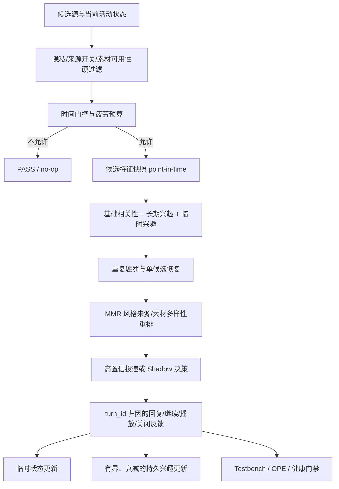

# N.E.K.O. 主动搭话推荐系统：技术路线、开源依据与产品化评估方案

> 文档状态：**研究路线与远期 Backlog（非当前实施规范）**
> 文档与生产实现归属分支：`feat/recommend-MVP`
> 最近完成离线工作分支：`feat/recommend-testbench`
> 编制日期：2026-07-16
> 最近复核：2026-07-21
> 当前实施规范：[`proactive-recommendation-current-scope.md`](./proactive-recommendation-current-scope.md)
> 评审结论：**P44-F2 已在 Recommendation Testbench 以 `no_candidate` 结项；当前没有自动获准的下一开发阶段。本文其余公式、框架和阶段均不构成开发授权。**

## 摘要

N.E.K.O. 的主动搭话不是传统的“用户打开页面后，从固定商品库中挑选 Top-K”，而是一个同时包含以下约束的交互式决策问题：

1. 系统首先要判断**现在是否适合主动搭话**；
2. 只有通过隐私、来源开关、时间和防打扰约束后，才允许选择素材；
3. 候选来自 music、news、video、meme、vision 等动态来源；
4. 用户反馈稀疏、延迟且强弱不同，不能把没有回复简单视为不喜欢；
5. 用户的稳定兴趣和当前会话兴趣需要分开建模；
6. 排序质量、来源多样性、重复疲劳和安全性必须同时满足，而不能只优化点击或回复。

本文将该问题形式化为一个**安全门控约束下的上下文推荐问题**，并保留以下远期研究路线：

> **现有硬约束与调度 → 可解释候选排序 → 显式反馈归因 → 经独立评审的个性化/多样性候选 → 数据充分后的 Shadow/OPE/受约束 contextual bandit。**

学术上，该路线以 contextual bandit、长短期用户建模、延迟反馈、MMR/DPP 多样性和 off-policy evaluation 为依据；工程上，以 [Mab2Rec](https://github.com/fidelity/mab2rec)、[MABWiser](https://github.com/fidelity/mabwiser)、[River](https://github.com/online-ml/river)、[Open Bandit Pipeline](https://github.com/sb-ai-lab/sb-obp)、[Recommenders](https://github.com/recommenders-team/recommenders) 和 [Feast](https://github.com/feast-dev/feast) 为主要参考。

当前系统的安全采集与结构可用性已经得到验证。P44-E2 已完成人工主审、28/28 盲二审和轻量裁决，得到 128 条有效评估样本；P44-F1 的结论为 `no_universal_threshold_candidate`。随后 timing v3 baseline 已在首个 105 observation / 30 显式关联 feedback turn 截点冻结，timing 契约错误为 0。P44-F2-B 因同 cohort 缺少人工 `should_recommend` 标签而结论为 `no_candidate`，没有生成疲劳公式或模拟。当前证据仍不能证明个性化策略已经改善生产效果。

---

## 1. 研究问题与产品目标

### 1.1 决策问题

令时刻 `t` 的安全候选集合为 `A_t`，上下文为 `x_t`，系统需要作出两层决策：

1. `g_t ∈ {PASS, SPEAK}`：是否主动搭话；
2. 当 `g_t = SPEAK` 时，从 `A_t` 选择候选 `a_t`。

目标不是单纯最大化回复率，而是在硬约束下最大化长期用户效用：

\[
\max_{\pi}\; \mathbb{E}\left[\sum_t R(x_t,a_t)\right]
\]

同时满足：

\[
\begin{aligned}
&\text{privacy violation}=0,\\
&\text{disabled-source exposure}=0,\\
&\text{minimum-interval violation}=0,\\
&\text{exact duplicate within cooldown}=0,\\
&\text{interruption risk}\leq\text{approved baseline}.
\end{aligned}
\]

### 1.2 产品目标

技术路线应支持以下可验证目标：

- 在不增加隐私和稳定性风险的前提下，降低“不该搭话却搭话”的比例；
- 保持或提高用户对主动搭话的正向回应与继续交流；
- 降低候选重复、连续同来源曝光和单一来源集中度；
- 使“回复快”相对于用户自身习惯定义，而不是固定 60 秒；
- 将当前会话兴趣与跨会话稳定兴趣分开，避免瞬时行为永久污染画像；
- 为未来的 contextual bandit 和反事实评估保留完整且可审计的数据契约。

### 1.3 非目标

当前阶段不以以下事项为目标：

- 不训练大型深度顺序推荐模型；
- 不使用完整屏幕文本、截图或聊天原文训练偏好；
- 不把“用户未回复”一律解释为负反馈；
- 不为了探索而绕过隐私、时间、来源开关和重复约束；
- 不要求本轮覆盖 `gaming`；该状态缺乏可靠实测条件，保持内置契约覆盖即可；
- `away`、`busy` 只在自然出现时记录，不作为当前 Golden cohort 的阻塞门槛。

### 1.4 当前组件边界

当前产品边界以 [`proactive-recommendation-current-scope.md`](./proactive-recommendation-current-scope.md) 为准：

- 前端调度器与主动搭话路由负责何时产生机会、曲线回退、抖动、固定模式和硬门控；
- 推荐器只对已经安全的候选做确定性排序，不重复实现调度和时间硬门控；
- `PASS/no-op` 当前是 Testbench 的 Gate 评价维度，不是新增的生产 bandit arm 或第二套路由 gate；
- timing v3 只用于观测和离线分析，不进入生产排序；
- Testbench 只模拟和验收，不写生产配置、权重或 tuning。

任何跨越上述边界的机制必须单独立项，不能因为出现在本文中而自动进入 MVP。

---

## 2. 当前系统基线与证据

### 2.1 已有实现

当前推荐器位于 [`main_logic/proactive_recommendation.py`](../../main_logic/proactive_recommendation.py)，具备：

- 来源开关、隐私状态、重复标记和 busy/activity 硬过滤；
- 由来源权重、新鲜度、上下文匹配、静态兴趣、novelty、质量、交互价值、打扰成本和风险组成的线性分数；
- 最近来源重复、连续来源 streak 和候选 ID 重复惩罚；
- `shadow` 与 `active_source` 模式；
- `active_source` 只有 Top-1/Top-2 分差达到默认 `0.05` 才施加偏置；
- 观察日志与实际投递通过 `turn_id` 关联。

当前基础评分可概括为：

\[
\begin{aligned}
s_{base}={}&0.20w_{source}+0.15f_{fresh}+0.25m_{context}+0.15m_{interest}\\
&+0.15n_{novelty}+0.10q_{source}+0.05v_{interaction}\\
&-0.25c_{interrupt}-0.30p_{risk}+adjustments-penalty_{diversity}.
\end{aligned}
\]

其中 `_user_interest_match` 目前仍主要是按来源写死的静态值，尚未消费真实用户反馈。

[`main_logic/proactive_recommendation_feedback.py`](../../main_logic/proactive_recommendation_feedback.py) 已记录 `user_reply_fast`、`user_reply`、`user_continue`、音乐播放完成度、关闭/跳过和设置关闭等事件，并坚持只保存白名单元数据。但当前 `user_reply_fast` 使用固定 `60s` 阈值，不能适配慢回复用户。

[`main_logic/proactive_recommendation_observer.py`](../../main_logic/proactive_recommendation_observer.py) 已实现：

- observation schema v3；
- 安全 `review_context`；
- 候选 ID 对齐；
- URL/secret 清除；
- 标题、摘要、投递摘录长度上限；
- 缺少安全复核上下文时禁止人工 relevance 标注。

前端通过 [`static/app/app-proactive.js`](../../static/app/app-proactive.js) 把 `base_interval_seconds` 发送给后端；timing v3 已将基础间隔、实际投递间隔、30 分钟/2 小时投递计数和连续未回应数写入 `decision_context.timing`。这些字段目前只作观测和 Testbench 分析，不进入推荐排序，也不改变调度器现有曲线回退。

### 2.2 已完成的技术门禁

根据现有 P0/P1 计划和 Recommendation Testbench 记录：

- P41 后端契约 smoke：通过；
- P42 UI 契约 smoke：通过；
- 执行错误：0；
- 硬约束违规：0；
- observation/feedback 的隐私与关联契约可用；
- `tuning=off`，生产权重没有因采集或分析被自动修改。

历史 Testbench 使用过 44 个 builtin 场景；最新 `recommendation_builtin_v2` manifest 已收敛为 **27 个 canonical 场景**，版本为 `2.0.0`，并包含 contract、ranking、sequence、privacy、diversity 和 active-bias 边界。历史 run 与 v2 canonical suite 必须分开报告，不能混用分母。

### 2.3 P44-E 原始冻结与后续裁决状态

正式冻结产物：

- Freeze：`shadow-p44e-golden-final-20260716-134814.json`；
- SHA-256：`296E663C7E9EDCFEFAD262D845EA3A80B9D807AC350EE56D7F1824DD86F5BC78`；
- annotation-ready observation：137；
- 显式 joined feedback turn：30；
- review_context 安全校验失败：0；
- 缺失/重复 observation turn ID：0；
- orphan feedback：0（最终 cohort 已排除无关联记录）；
- mixed algorithm version：false；
- 算法版本：`0.8.3:proactive-recommendation-observation-v2`。

上述 137/30 是人工裁决前的原始 P44-E 冻结。后续已完成 137/137 主审、28/28 盲二审和 P44-E2 轻量裁决；排除弃权后有效指标样本为 128，Validator 与 readiness 通过。两批数据的用途不同，不得把原始 freeze、裁决后的 Golden 和 timing-v3 baseline 混用分母。

分布如下：

| 维度 | 分布 |
|---|---|
| 来源 | meme 43、music 21、news 17、video 6、vision 50 |
| Activity | idle 110、chatting 18、transitioning 9 |
| 显式反馈 | music_error 8、music_high_completion 1、music_played_through 7、user_continue 4、user_reply 5、user_reply_fast 9 |

局限：最终 cohort 没有形成 `focused_work` 有效样本。未来若某个候选通过独立评审，其证据适用范围最多先限于 idle/chatting；这不构成当前生产策略授权。`focused_work` 只能单独积累证据，`gaming` 明确不属于本轮覆盖目标。

### 2.4 已有离线实验说明了什么

`News -0.02` 候选曾降低来源集中度，但导致：

- Hit@1 从 `0.8750` 降至 `0.8125`；
- nDCG@3 从 `0.9661` 降至 `0.9480`；
- 配对结果 0 win / 1 loss / 24 ties。

因此该候选维持 **NO-GO**。这证明当前门禁能够阻止“分布看起来更均衡、但相关性实际下降”的调参进入生产。

### 2.5 Codex 辅助预标注是历史中间产物

`codex-first-pass-v5` 给出的预览为：Hit@1 `0.854`、MRR `0.1983`、nDCG@3 `0.9262`、应推荐率 `0.3869`。这些结果只能作为人工 review 的工作底稿，原因包括：

1. 标注来源是 `codex_assisted_first_pass`，`human_review_required=true`；
2. 137 条仍需人工确认，28 条需要第二次复核；
3. 当前 Hit@1 在“所有候选 relevance 都为 0”时仍可能把任意 Top-1 视为并列最优，导致数值虚高；
4. Hit@1 高而 MRR 低，正说明“是否该搭话”和“正例中的候选排序”尚未被彻底分离。

这些限制解释了为什么后来必须进行人工主审、盲二审和裁决。它们不再描述当前标注进度，但仍是数据治理的历史依据。

当前产品状态应定义为：

> **安全与数据链路：已通过；人工裁决 Golden：可用于离线评估；统一阈值候选：不存在；P44-F2 timing 候选：不存在；生产 active_source：HOLD。**

---

## 3. 学术依据与开源仓库参考

### 3.1 最符合的技术范式：Contextual Bandit

Li 等人将动态新闻推荐形式化为 contextual bandit：算法根据用户与候选上下文选择内容，再依据点击反馈持续调整策略。该工作指出动态候选池使传统协同过滤不总是适用，并给出了基于日志流量的离线评估思路。[论文](https://arxiv.org/abs/1003.0146)

这与 N.E.K.O. 的共同点是：

- 候选池动态变化；
- 只观察被投递候选的真实反馈；
- activity、时间、最近来源和兴趣都是上下文；
- 系统需要在利用已有偏好与尝试新来源之间平衡。

但 N.E.K.O. 比经典新闻推荐多一层“是否应主动打扰”的决策，因此不能直接使用纯 bandit 替换整个管线，必须保留安全门控和 `PASS/no-op`。

### 3.2 仓库对照

| 仓库 | 已提供能力 | 对本项目的直接价值 | 可行性判断 |
|---|---|---|---|
| [Fidelity Mab2Rec](https://github.com/fidelity/mab2rec) | Bandit recommender、context-free/parametric/non-parametric contextual policy、Top-K、benchmark、eligibility、item availability、persistency | 最接近“在安全候选中根据上下文选择下一素材”；高级示例与候选可用性直接对应动态来源 | **概念适配最高；先用于 Testbench，不直接替换生产管线** |
| [Fidelity MABWiser](https://github.com/fidelity/mabwiser) | Epsilon Greedy、LinTS、LinUCB、Thompson Sampling、UCB、Softmax、邻域策略及 simulator | 可作为来源级/候选级 contextual bandit 原型，避免自行实现整套 bandit | **适合后续策略实验；当前反馈量不足以生产化** |
| [Open Bandit Pipeline](https://github.com/sb-ai-lab/sb-obp) | logged bandit data、Replay、IPW、SNIPW、DR、Switch、MRDR 等 OPE | 给出未来日志契约与反事实评估工具；要求 action probability/`pscore` | **评估层高度适合；当前确定性日志尚不能支持有效 OPE** |
| [River](https://github.com/online-ml/river) | 流式统计、在线模型、bandit、漂移检测、progressive validation | 回复时延滚动基线、衰减兴趣、逐事件更新和漂移监控的成熟参考 | **算法参考适合；当前上游依赖与主程序 NumPy 版本冲突，不宜直接作为运行时依赖** |
| [Recommenders](https://github.com/recommenders-team/recommenders) | 数据拆分、离线评估、长短期兴趣模型、时间感知模型、diversity/novelty/coverage/serendipity 指标 | 提供指标定义和长短期兴趣的工程范式 | **适合作为评估与架构参考，不适合当前小样本直接训练深度模型** |
| [RecBole](https://github.com/RUCAIBox/RecBole) | 94 个通用、顺序、上下文和知识型推荐算法，统一数据与评估协议 | 可作为未来大样本模型 benchmark | **当前单用户、小样本、本地运行场景过重** |
| [Feast](https://github.com/feast-dev/feast) | offline/online feature store、point-in-time correct join | 指导 Testbench 只使用决策发生前可获得的特征，避免未来反馈泄漏 | **只借鉴 point-in-time 契约，不引入完整 feature store** |
| [implicit](https://github.com/benfred/implicit) | ALS、BPR、Logistic MF、Item-Item implicit feedback | 适合多用户—多物品矩阵 | **与当前单用户主动搭话不匹配，不采用** |
| [Vowpal Wabbit](https://github.com/VowpalWabbit/vowpal_wabbit) | 高性能在线学习与 contextual bandit | 大规模后可作为替代 policy engine | **当前集成和运维复杂度高于收益，暂不采用** |

### 3.3 开源方案可行性边界

最符合的是 **Mab2Rec/MABWiser 的决策范式**，但不是整包替换：

- 它们已经解决“上下文 + 候选 + 奖励 → 更新下一次选择”的通用问题；
- 它们不能代替隐私、时间、来源开关、重复冷却和防打扰业务规则；
- Mab2Rec/MABWiser 当前依赖 pandas、scikit-learn、SciPy 等，而本项目运行时未引入 pandas/scikit-learn；
- River 当前上游 `main` 要求 `numpy>=2.2.5`，本项目固定 `numpy~=1.26.4`，因此不能为了少量滚动统计直接加入生产依赖；
- OBP 中的 `pscore` 是**动作选择概率**，与当前 observation 的 `activity_propensity` 完全不同，二者不得混用。

因此，“不重复造轮子”的正确解释是：

1. 使用成熟的 contextual bandit/OPE 抽象和工具做隔离实验；
2. 使用已有指标与统计定义；
3. 不复制成熟算法的大型实现；
4. 对生产路径只保留本项目特有、可解释且依赖轻量的安全门控和状态适配层。

### 3.4 长短期兴趣与时间建模依据

[SLi-Rec](https://www.ijcai.org/proceedings/2019/585) 将长期偏好和短期行为分开建模，并通过 time-aware controller 与 content-aware controller 按具体上下文融合。这支持本项目把“稳定来源兴趣”与“当前会话兴趣”分开，而不是将每次回复永久写入同一个权重。

延迟反馈研究表明，推荐后的反馈不一定立即到达，直接把未到达反馈视为负例会引入偏差。[Linear Bandits with Stochastic Delayed Feedback](https://proceedings.mlr.press/v119/vernade20a.html) 因此，本项目必须保留反馈窗口、pending turn 和延迟归因，并让回复速度只作为附加信号。

### 3.5 多样性依据

MMR 的核心是同时优化相关性与新颖性，减少结果间冗余；DPP 则以“排斥”方式生成相关且多样的集合。[MMR DOI](https://doi.org/10.1145/290941.291025)、[NeurIPS DPP diversity](https://papers.neurips.cc/paper_files/paper/2018/hash/dbbf603ff0e99629dda5d75b6f75f966-Abstract.html)

本项目候选数量较小、来源类型有限，采用 MMR 风格的轻量重排比 DPP 更符合 MVP；DPP 保留为大候选集时的研究参考。

### 3.6 反事实评估依据

[Open Bandit Dataset and Pipeline](https://datasets-benchmarks-proceedings.neurips.cc/paper_files/paper/2021/hash/33e75ff09dd601bbe69f351039152189-Abstract-round2.html) 提供了 logged bandit feedback 与 OPE 的标准化流程。其关键启示是：没有行为策略的动作概率，就不能仅凭确定性历史日志无偏估计另一策略的效果。

因此，当前裁决后的 128 条有效 Golden 可用于人工监督评估和同输入重放；timing 分析另使用 105/30 baseline freeze。两者都不能被宣称为有效的 bandit OPE。

---

## 4. 研究候选技术路线（非当前 MVP 规格）

### 4.1 总体架构

下图描述可能的长期形态，不表示所有层应同时实现。当前批准范围止于现有硬约束、确定性候选排序、显式反馈归因和 Testbench 离线分析。



### 4.2 第一层：复用现有调度与硬门控

当前系统已经在调度器和主动搭话路由中执行总开关、来源开关、privacy/activity、候选可用性、重复保护、曲线回退、抖动和更高优先级提醒等控制。Recommendation MVP 不再实现第二套时间硬门控。

must-fire reminder 属于独立提醒链路，不参与推荐兴趣学习，避免把工作休息提醒误当成素材偏好。

#### 时间特征仅作为离线研究变量

timing v3 提供基础间隔、实际投递间隔、近期投递计数和连续未回应数。Testbench 可以研究这些连续变量与误打扰/显式反馈的关系，但不得把 `Δt / 基础间隔` 当成实际调度状态，也不得据此直接增加生产 `eligible` gate：实际间隔还受到曲线回退、跳过、固定模式和运行状态影响。

若离线结果支持某个简单的临时疲劳候选，应先形成独立设计和 Shadow preview，再决定是否进入 MVP。本文原有指数恢复、指数衰减及其参数只保留为研究假设，不是已批准公式。

### 4.3 `PASS/no-op` 进入评价，不新增生产决策门

主动搭话系统不能只评价“哪一个候选最好”，还必须评价“这次是否根本不该搭话”。当前将 `should_recommend`/`PASS` 作为 Testbench Gate 标签，与正例上的候选排序指标分开。

生产路由已经存在多种 skip/pass 出口。当前不在推荐器中新增统一阈值或第二套 `PASS` gate；只有未来数据和独立设计证明必要时，才重新讨论将 `PASS` 纳入策略动作空间。

### 4.4 第二层：可解释候选评分

以下展开项是**彼此独立的研究候选**，不是要求下一版一次性叠加的 MVP 公式。任何候选都必须先在固定输入上单变量评估，再由独立设计决定是否进入生产排序。

长期可研究在当前线性评分上增加：

\[
\begin{aligned}
s(c,t)={}&s_{base}(c,t)+s_{time}(t)+b_{persistent}(u,c)\\
&+b_{ephemeral}(session,c)+b_{feedback}(u,c,t)\\
&-p_{repeat}(c,t)-p_{source}(c,t)-p_{risk}(c,t).
\end{aligned}
\]

所有新增项必须进入 `score_breakdown`，不得只记录最终分。

### 4.5 个体回复速度

> 状态：P44-G0-B 的 Shadow-only 相对回复速度 preview 已完成；固定 60 秒事件标签仍保留为原始事实，preview 不进入排序、PASS、投递或 tuning。生产消费继续 `HOLD`。

当前固定 `REPLY_FAST_SECONDS=60` 会把慢回复用户系统性判为低兴趣。建议拆成两个信号：

1. **发生回复**：独立的正向 engagement，不依赖快慢；
2. **相对回复速度**：只作为小幅 bonus，基于用户自身历史。

在至少 5 次有效回复前，速度 bonus 保持中性；达到最低样本后，对 `log(1+latency)` 维护稳健基线，例如中位数和 MAD/IQR：

\[
z_{speed}=\frac{median_u-\log(1+latency_t)}{\max(scale_u,\epsilon)}.
\]

\[
b_{speed}=b_{max}\cdot sigmoid(z_{speed}).
\]

约束：

- 慢于个人平均不直接形成负分；
- 只有在反馈窗口结束且满足可归因条件时，才能产生低置信 ignored；
- 不持久化单次原始 latency，只保存聚合统计；
- 按 activity 分层统计可作为后续扩展，但当前样本不足时先使用全局个人基线。

### 4.6 临时状态与持久状态

> 状态：P44-G0-C/D 已实现 2 小时临时状态与来源级持久证据 preview；它们只用于审计，不是生产画像。衰减、删除治理及排序消费继续 `HOLD`。

#### 临时状态（内存，TTL 建议 2 小时）

- 当前会话 source/candidate 兴趣 boost；
- 最近投递队列、source streak；
- 当前 activity；
- 单候选被抑制次数；
- 投递疲劳；
- 最近一次显式正/负反馈；
- pending feedback attribution。

临时状态在进程重启或 TTL 到期后清除，不写入长期画像。

#### 持久状态（本地、聚合、衰减）

- 回复 latency 的 count、稳健中心和尺度；
- 各 source/family 的正负证据计数或有界 affinity；
- 最后更新时间和衰减版本；
- 用户显式关闭的来源；
- schema/policy version。

持久状态不得包含：

- 聊天原文；
- 完整标题历史；
- 屏幕文本或窗口标题；
- URL、cookie、token；
- 每次具体回复 latency 明细；
- 截图或候选原始 payload。

#### 稳定兴趣

建议使用带先验且随时间衰减的证据，而不是一次回复直接永久加权。可解释形式为：

\[
affinity_{u,s}=\frac{\alpha_0+positive_{u,s}}{\alpha_0+\beta_0+positive_{u,s}+negative_{u,s}}.
\]

在读取或更新时按半衰期衰减证据；只有重复出现的显式反馈才改变长期 affinity。一次快速回复只进入临时 boost，不直接形成长期偏好。

### 4.7 反馈与奖励

> 状态：P44-G0-A 的 `reward_score_v2_preview` 已完成，原始 feedback event 与既有生产逻辑保持不变。将 preview 作为生产 reward 或排序输入继续 `HOLD`。

未来若证据充分，可评估新的 `reward_score_v2`，并保留原始 event type 以便重算：

\[
R_t=clip(R_{reply}+R_{continue}+R_{consumption}+R_{relative\_speed}-P_{interrupt}-P_{settings},-1,1).
\]

原则：

| 信号 | 解释 | 置信度 |
|---|---|---|
| user reply | 对投递产生回应，基础正向；不依赖快慢 | 中 |
| relative speed bonus | 相对本人基线更快，只做小幅附加正向 | 中 |
| user continue | 用户主动延续话题，强于单次回复 | 中高 |
| music completion/played through | 对音乐候选的来源特定正向 | 高 |
| hard skip/early close | 来源特定负向 | 中高 |
| ignored | 可能是未看见、忙碌或延迟回复，只是弱负向 | 低 |
| proactive/source disabled after | 明确设置行为，强负向 | 高 |
| music_error/autoplay_blocked | 技术失败，不是偏好证据 | 不计偏好 |

下一次推荐的兴趣增益必须与被投递的 `candidate_id/source_type` 通过 `turn_id` 关联，不能将回复无差别加到所有候选。

### 4.8 重复、meme 与单候选恢复

> 状态：研究候选，`HOLD`。当前 MVP 继续使用推荐器已有的 candidate/source/streak 软惩罚，以及投递层的文本相似度/BM25 硬去重；不得在同一阶段再叠加 semantic repeat、分次硬过滤和 recovery。

#### 普通素材重复

候选身份优先使用 `candidate_id`；必要时使用规范化的 `source_type + safe_title`。未来可分别评估：

- 第二次相同素材：显著降分；
- 第三次及以后：在 cooldown 内硬过滤；
- 连续相同来源：单独计算 source streak penalty；
- 标题不同但 family/摘要近似：作为 semantic repeat 进入软惩罚。

重复素材的主动搭话类似对用户反复追问，应比普通“同来源”受到更强惩罚。

#### Meme

当前 meme 的来源 ID 与占位标题不足以可靠识别素材是否相同，因此 item-level 默认按“不重复素材”处理；但不能持续给予高分。正确做法不是强行让 relevance 标签服从正态分布，而是：

- 保留真实人工 relevance；
- 对 meme 来源应用滚动曝光、连续来源和疲劳惩罚；
- 让不同时间与上下文下的最终分自然分散；
- 以 source share、streak、entropy/HHI 检验多样性。

人为把 Golden 标签拟合成正态分布会污染真值，因此禁止。

#### 单候选恢复

若现有简单惩罚在 Golden 上仍造成显著 missed opportunity，未来可单独评估适用于所有来源的恢复规则，而不只针对 vision：

- 只有一个安全候选且之前因多样性/重复软约束被抑制；
- 调度器已产生搭话机会，且现有硬约束均已通过；
- 没有明确负反馈、隐私风险或来源关闭；
- 可以给予有上限的 recovery bonus，使系统偶尔恢复候选；
- 投递后重置该来源的 suppressed counter；
- 技术错误候选（如 `music_error`）不能触发兴趣恢复。

该机制表示“缺少新话题时允许保守恢复”，不是绕过重复硬过滤。

### 4.9 多样性重排

> 状态：远期候选，`HOLD`。当前候选列表短且主要投递 Top-1，先验证已有 source/candidate/streak penalty；只有简单方法不能满足门禁时才评估 MMR。

未来可在基础分之后评估 MMR 风格重排：

\[
MMR(c)=\lambda s(c)-(1-\lambda)\max_{j\in selected}sim(c,j)-exposurePenalty(c).
\]

`sim(c,j)` 可由以下可审计项组成：

- 是否同 candidate ID；
- 是否同规范化标题；
- 是否同 family；
- 是否同 source；
- 是否连续出现。

当前候选列表短，不需要引入向量数据库或 DPP 运行时。

### 4.10 Contextual bandit 的进入位置

> 状态：远期研究，`HOLD`。当前 30 个显式反馈不足以训练或验收生产 bandit，本节不产生 MVP 工程项。

当数据达到要求后，MABWiser/Mab2Rec policy 只替换“安全候选的个性化选择”部分：

```text
existing hard gate/scheduler → safe candidate set
          → contextual policy score
          → diversity rerank
          → confidence gate
          → delivery
```

首个 bandit 实验应以**来源级 arm** 为主，而不是把每条动态内容都当成独立 arm：

- arms：music、news、video、meme、vision；
- context：activity、相对间隔、疲劳、长期 affinity、临时 boost、最近来源、候选质量；
- reward：`reward_score_v2`；
- no-op：单独由第一层 gate 处理，数据充分后再比较纳入 arm 的方案。

优先比较：

1. 当前可解释线性策略；
2. context-free Thompson/UCB；
3. LinUCB/LinTS；
4. 不探索的监督式/贪心基线。

在没有有效 OPE 和用户 opt-in 前，生产不得开启无约束 epsilon exploration。

### 4.11 日志与 OPE 契约

> 状态：远期研究，`HOLD`。以下是安全随机化获批后的候选契约，不得加入当前 observation v3，也不得为 OPE 提前扩张 MVP。

未来 observation 可考虑新增：

```json
{
  "policy_id": "guarded-linear-v2",
  "policy_version": 2,
  "decision_id": "uuid",
  "action_set": ["music", "news", "meme", "vision", "PASS"],
  "selected_action": "meme",
  "action_propensity": 1.0,
  "selection_mode": "deterministic",
  "timing_context": {
    "base_interval_seconds": 60,
    "elapsed_since_delivery_seconds": 143,
    "interval_ratio": 2.383,
    "fatigue_score": 0.21
  },
  "profile_snapshot_version": 1
}
```

注意：确定性策略记录 `action_propensity=1.0` 只能说明当前动作由确定性策略选择，不能为未选择动作创造反事实支持。只有经过批准的安全随机化产生非退化 propensity 后，IPW/DR 等 OPE 才具有可解释性。

所有训练和评估特征必须 point-in-time correct：不得使用该 observation 之后发生的回复、兴趣更新或未来曝光计算当时分数。

---

## 5. Testbench 与效果评估设计

### 5.1 必须拆开的三类问题

| 层 | 问题 | 主指标 |
|---|---|---|
| Gate | 现在是否应该主动搭话 | precision/recall/F1、false interruption rate、missed opportunity rate |
| Rank | 应搭话时哪个候选最好 | positive-case Hit@1、MRR、nDCG@3、acceptable Top-1 |
| Product | 搭话后用户体验是否改善 | 正向反馈率、continue rate、关闭率、重复率、来源集中度、延迟与稳定性 |

### 5.2 修正 Hit@1 定义

排序指标只在以下正例上计算：

```text
should_recommend == true
AND 至少一个候选 relevance > 0
```

负例通过 `PASS/no-op` 的 gate 指标评估。禁止在“所有候选 relevance=0”时把任意候选算作 Hit@1。

Testbench 应同时报告：

- `decision_accuracy_with_noop`；
- `false_interruption_rate`；
- `positive_case_hit_at_1`；
- `positive_case_ndcg_at_3`；
- 每个指标的 numerator/denominator。

### 5.3 标注质量

P44-E2 已完成 137/137 主审、28/28 盲二审和 11/11 A 级轻量裁决；排除 9 个弃权后，有效指标样本为 128，Validator 与 readiness 通过。该结果是当前离线 Golden 候选，不再把 Codex 预标注视为未完成任务。

后续扩充 Golden 时继续遵守：

1. 新样本必须人工 accept/correct，不能把辅助预标注自动升级为 Golden；
2. 按预先固定的抽样规则做盲法复核，并报告实际分母；
3. 有独立第二审核者时，二元标签报告 Cohen's kappa，0–3 relevance 报告 weighted kappa；只有单审核者时，报告 intra-rater agreement；
4. 分歧较大的样本进入裁决或标为低置信/弃权，不以工程 readiness 冒充高一致性；
5. 所有 `privacy_risk=violation` 必须逐条仲裁，不能通过平均分抵消。

### 5.4 离线指标

#### 相关性与 Gate

- `should_recommend` precision、recall、F1；
- false interruption rate；
- missed opportunity rate；
- positive-case Hit@1、MRR、nDCG@3；
- acceptable Top-1；
- baseline/candidate 配对 wins/losses/ties。

#### 多样性与重复

- exact candidate repeat rate；
- semantic/title repeat rate；
- source streak P50/P95/max；
- max source exposure；
- source HHI 与 entropy；
- meme exposure share；
- single-candidate recovery 触发次数、成功反馈率与误触发率。

#### 时间与个性化

- minimum interval violation；
- `interval_ratio` 分布；
- 每小时/会话主动投递数；
- fatigue score 与 negative/ignored 的关系；
- 用户相对回复速度分桶后的 engagement；
- cold-start 与 warm-state 分层结果；
- persistent affinity 更新前后的来源选择变化；
- activity 分层指标。

#### 校准、性能与安全

- score bucket 的正向反馈单调性；
- Brier score/ECE（只有标签定义稳定后启用）；
- p50/p95/p99 推荐层延迟；
- observation/feedback 写入失败率；
- forbidden fields、URL、turn ID、candidate alignment、algorithm version；
- hard constraint violations 和 execution errors。

### 5.5 统计方法

- baseline 与 candidate 必须在同一冻结输入上配对；
- 对差值使用 paired bootstrap 95% confidence interval；
- 二元指标可使用配对 bootstrap 或 McNemar 检验；
- relevance 0–3 使用 weighted kappa 评估复核一致性；
- 同时比较多个候选时使用 Holm 校正，避免反复试参造成假阳性；
- 所有百分比保留 numerator/denominator；
- 样本不足时结论必须是 HOLD，而不是“无显著下降等于通过”。

### 5.6 离线准入门槛

当前无待准入的生产候选。隐私、契约、执行错误和硬约束是现行确定性门禁；下表其余质量阈值仅是**未来候选的初始评审模板**，不是 P44-F2 readiness，也不能单凭达到某个点估计就授权改生产。

| 维度 | 准入条件 |
|---|---|
| 隐私/契约 | forbidden/URL/secret/ID alignment/version 错误全部为 0 |
| 执行 | execution error=0，hard constraint violation=0 |
| Gate | false interruption rate 不高于 baseline；95% CI 上界不得超过 +2 个百分点 |
| 排序 | positive-case nDCG@3 差值 95% CI 下界 ≥ -0.01 |
| Top-1 | acceptable Top-1 差值 95% CI 下界 ≥ -0.02 |
| 重复 | exact duplicate cooldown violation=0；candidate repeat rate 不高于 baseline |
| 多样性 | max source exposure 与 HHI 至少一项改善，另一项不得明显退化（HHI +0.02 以上视为退化） |
| 打扰 | interruptive 标注率不得上升；来源关闭/总开关关闭事件不得上升 |
| 校准 | 高分桶反馈不得低于中分桶；无法形成有效分桶时 HOLD |
| 性能 | 推荐排序层 p95 新增耗时建议 <20 ms，且不得延长 LLM/投递关键路径 |

未来立项时应基于固定 Golden、候选目标和统计功效预注册适用阈值；若样本不足则报告区间与 `HOLD`，不得把上表的示例数值当作永久产品 SLA。

### 5.7 Shadow 验证

> 状态：未来候选通过离线门禁后的验证模板，不是当前采集任务。

未来完成离线门禁后，可新建一个不改变生产投递的 Shadow cohort。`200/50/7 日` 是早期容量建议，正式样本量应由候选风险、基线率和最小可检测效果确定：

- 至少 200 条新的 annotation-ready decision；
- 至少 50 个显式 joined feedback turn；
- 覆盖至少 7 个自然日，避免单时段偏差；
- idle/chatting 必须覆盖；
- `focused_work` 单独累计至少 20 条后，才允许该 context 进入生产策略；
- `gaming` 不属于本轮要求；
- tuning 继续保持 `off`；
- 同时运行 baseline 与 candidate，记录相同输入下的配对差异。

### 5.8 在线 Canary/A-B

> 状态：远期发布方案，`HOLD`；当前单用户开发样本不支持百分比分桶。

仅在人工标注、离线和 Shadow 全部通过后执行：

1. 开发者 opt-in；
2. 5% 稳定设备/用户分桶；
3. 25%；
4. 全量。

每一级均需独立观察窗口和回滚点。在线主指标建议为：

- false interruption rate 相对下降目标：≥10%；
- positive engagement rate 非劣界：不低于 baseline 3% 相对值；
- user_continue rate；
- source/proactive disabled-after rate 不增加；
- exact repeat violation=0；
- crash、请求错误和 p95 latency 不增加。

上线样本量不应固定拍脑袋决定，应依据 baseline rate、期望最小效果 MDE、显著性水平和统计功效计算。若产品用户量不足，则延长观察期或保持 HOLD，不得用几十条事件宣布 uplift。

### 5.9 Contextual bandit 准入

> 状态：远期研究前置条件，不属于当前 MVP 或 Testbench P44-F2。

建议满足以下数据条件后再评估真实 bandit：

- 至少 500 个可归因显式 feedback turn；
- 主要来源各自至少约 50 个可用反馈，或通过功效分析证明更少样本足够；
- `reward_score_v2` 已稳定，不再频繁修改；
- action set、selected action、policy ID 和 propensity 日志完整；
- offline replay/OPE 与 deterministic baseline 结果一致可复现；
- 探索只发生在通过全部硬约束的候选中；
- 首轮探索仅限明确 opt-in 用户。

在此之前，MABWiser/Mab2Rec 的价值是**验证策略结构**，不是直接为当前 30 条反馈训练生产模型。

---

## 6. 分阶段开发计划

### 已完成：P44-F2 timing/fatigue 离线分析

P44-F2 已在 Recommendation Testbench 结项：

- 使用冻结的 timing v3 `105 observation / 30 explicit feedback` baseline；
- 五个 timing 字段、point-in-time 正确性和固定输入可复现性通过；
- 绝对 `5/10/30` 分钟桶已降为描述项，不再作为 readiness 门禁；
- 连续变量分析发现 `recent_delivery_count_30m` 与显式反馈分数存在稳定相关，但这只是观察性辅助证据；
- 同 cohort 人工 `should_recommend` 标签为 0，误打扰和错失机会不可计算；
- 正式结论为 `no_candidate`，没有生成 fatigue 公式或运行真实 cohort 候选模拟。

该结论关闭 P44-F2 授权，不自动打开重复、来源多样性或其他研究阶段。生产配置、权重、调度和 tuning 均未修改。

### 已完成的评估基础

- P44-E2：人工 Golden 裁决完成，有效样本 128；
- P44-F1：统一 PASS/no-op 阈值分析完成，结论为 `no_universal_threshold_candidate`；
- timing v3：生产只读观测字段与首个 105/30 baseline freeze 完成。
- P44-F2-B：连续变量关联分析完成，结论为 `no_candidate`。
- P44-G0：reward、个人相对回复速度及临时/持久聚合状态 preview 已完成；MVP 与 Testbench 的 `feedback_state_preview` 契约已同步，生产行为不变。

### 已完成 Preview 基础后的未来候选：全部 `HOLD`，逐项单独立项

| 候选 | 当前边界 | 进入 MVP 的最低前置条件 |
|---|---|---|
| 个人回复速度的生产消费 | 已有 point-in-time preview，不进入排序 | 独立候选、固定输入配对评估及增量证据 |
| 临时/持久兴趣的生产消费 | 已有有界 preview，不作为生产画像 | 明确衰减/删除治理，并通过离线非劣结果 |
| 重复与来源多样性 | 继续使用现有软惩罚与投递硬去重 | 现有简单机制被证明确有缺口；一次只测试一层 |
| MMR/单候选恢复 | 不进入当前 Top-1 路径 | 简单惩罚无法满足门禁，且 missed opportunity 有可靠标签 |
| Shadow candidate | 当前不新开 200/50/7 日采集任务 | 某一具体离线候选已通过预注册门禁 |
| Canary/自动 tuning | 保持 `off` | 多用户 opt-in、监控/回滚和候选发布评审完成 |
| Bandit/OPE | 不扩张 observation v3，不引入运行时依赖 | 反馈规模、有效 propensity、安全随机化与独立 ADR 全部满足 |

Testbench 的指标/Validator/固定 hash 可按需要维护，但不得借“正式准入”名义提前实现 MABWiser、Mab2Rec 或 OBP 集成。

---

## 7. 可行性与预期效果评价

### 7.1 技术可行性

| 维度 | 评价 | 依据 |
|---|---|---|
| 候选与硬过滤 | 高 | 当前纯函数推荐器、隐私/重复/activity 过滤已存在 |
| 安全可观测性 | 高 | schema v3、review_context、人工裁决 Golden 与 timing 105/30 freeze 均可复现 |
| 时间感知分析 | 高 | timing v3 五字段已存在且只读；当前只需在 Testbench 分析，不新增调度公式 |
| 回复个性化 | 高 | 已有 turn_id、delivered_at、reply latency；主要是统计与状态分层缺失 |
| 长短期兴趣 | 中高 | 可用有界聚合状态实现；需要防止反馈稀疏与一次事件过拟合 |
| 多样性重排 | 高 | 当前已有 source/candidate penalty，MMR 是渐进扩展 |
| Bandit 原型 | 中 | 开源实现成熟，但当前只有 30 个显式反馈，数据不足 |
| 有效 OPE | 低至中 | 当前没有非退化 action propensity；补契约并安全随机化后可提升 |
| 深度顺序模型 | 低 | 样本、用户数量和运行时约束均不支持 |

### 7.2 对效果的合理预期

在不提前宣称 uplift 的前提下，可给出机制层预期：

| 改动 | 最可能改善的指标 | 置信度 |
|---|---|---|
| 离线 timing/fatigue 候选 | 识别 false interruption 与近期全局投递负载的关系 | 当前无候选；缺少同 cohort 人工决策标签 |
| 个人回复时延基线 | 慢回复用户的误判、score calibration | 中 |
| 临时/持久兴趣分离 | 短期话题适配、长期来源稳定性 | 中 |
| 精确反馈归因 | source/candidate affinity 的可信度 | 高（数据质量） |
| 重复与 MMR 重排 | candidate repeat、source streak、HHI | 高 |
| 单候选恢复 | 长时间无候选时的 missed opportunity | 中，需严控误打扰 |
| contextual bandit | warm-state 个性化选择 | 当前低；反馈规模扩大后中高 |

### 7.3 当前是否符合产品预期

当前结论分三层：

1. **作为 Shadow 数据与安全管线：符合。** 契约、隐私和关联门禁已通过。
2. **作为 P44-F2 离线分析基础：符合且已完成。** timing v3 baseline 可复现，但与人工裁决 Golden 不是同一 cohort，不能跨批次拼接标签。
3. **作为已经证明有效的生产个性化推荐：不符合。** 当前没有通过门禁的生产候选，activity 覆盖仍偏 idle，也没有多用户或有效 OPE 证据。

因此正式决策为：

- **COMPLETE / NO CANDIDATE**：P44-F2 timing/fatigue 离线分析；
- **COMPLETE / NO-BEHAVIOR-CHANGE**：P44-G0 Shadow-only feedback state preview 与 Testbench 契约同步；
- **HOLD**：P44-G1/G2/G3、重复/来源多样性、MMR/恢复、生产个性化消费、普通用户 `active_source`、自动调权、Canary 和在线 bandit exploration；
- **NO-GO**：`News -0.02` 历史候选、把 Codex v5 预标注直接当 Golden、把固定 60 秒当通用回复速度、强制 meme 标签服从正态分布。

---

## 8. 主要风险与控制

| 风险 | 后果 | 控制措施 |
|---|---|---|
| 反馈稀疏/延迟 | 将未回复误判为不喜欢 | pending window、低置信 ignored、延迟归因、个人基线 |
| 暴露偏差 | 只学到旧策略经常展示的来源 | 配对 Shadow、记录 propensity、后续受约束随机化与 OPE |
| 反馈回路 | 高分来源越来越高，挤压其他来源 | 多样性重排、探索上限、来源曝光护栏 |
| 短期行为污染长期画像 | 一次回复造成长期偏置 | ephemeral/persistent 分离、最低证据数、衰减 |
| 时间泄漏 | 离线指标虚高 | point-in-time snapshot、时间顺序 replay |
| 指标定义错误 | Hit@1 虚高、负例被当排序成功 | gate/rank 拆分、no-op、positive-case metrics |
| 单用户过拟合 | 对开发者有效但对产品用户无效 | 稳定用户分桶、分用户指标、扩大 cohort 后再训练 |
| 隐私泄漏 | review/训练数据包含敏感内容 | 继续使用 review_context 白名单、聚合画像、0 容忍门禁 |
| 依赖膨胀 | 桌面打包和 NumPy 冲突 | 开源框架先隔离于 Testbench，生产依赖单独 ADR 审批 |

---

## 9. 最终建议

最适合 N.E.K.O. 的不是纯协同过滤、纯深度顺序模型，也不是直接让 bandit 控制所有主动搭话，而是：

> **边界清晰的 Guarded Recommender：调度器负责产生机会和曲线回退，路由负责硬约束，推荐器只排序安全候选，投递层负责文本去重，Testbench 负责离线证据。个性化状态与 bandit 只有在独立立项后才可能进入这条链路。**

该路线的优势是：

- 与现有代码结构兼容；
- 能逐阶段验证，每一步都可回滚；
- 可在数据成熟后隔离参考 Mab2Rec/MABWiser/OBP，而不把它们变成当前运行时依赖；
- 不要求当前小样本直接训练大型模型；
- 将“不打扰”和隐私置于模型收益之前；
- 能用正式指标判断何时可以进入产品，而不是以主观体验代替证据。

P44-F2 已正式得到 `no_candidate` 并停止。当前没有默认“下一项”：不得为了推动阶段而新增 scheduler 字段、补造标签、直接转做重复/多样性或调权。若产品决定继续，应先在“为 timing cohort 补充合规人工决策标签”与“另立一个独立研究问题”之间重新立项；个人回复时延、长短期兴趣、重复增强、MMR 和 bandit 均继续留在研究 Backlog，生产 tuning 保持关闭。

---

## 10. 参考文献与官方资料

1. Li, L., Chu, W., Langford, J., & Schapire, R. E. *A Contextual-Bandit Approach to Personalized News Article Recommendation*. WWW 2010. [arXiv](https://arxiv.org/abs/1003.0146)
2. Saito, Y., Aihara, S., Matsutani, M., & Narita, Y. *Open Bandit Dataset and Pipeline: Towards Realistic and Reproducible Off-Policy Evaluation*. NeurIPS Datasets and Benchmarks 2021. [Proceedings](https://datasets-benchmarks-proceedings.neurips.cc/paper_files/paper/2021/hash/33e75ff09dd601bbe69f351039152189-Abstract-round2.html)
3. Yu, Z., Lian, J., Mahmoody, A., Liu, G., & Xie, X. *Adaptive User Modeling with Long and Short-Term Preferences for Personalized Recommendation*. IJCAI 2019. [Proceedings](https://www.ijcai.org/proceedings/2019/585)
4. Vernade, C., Carpentier, A., Lattimore, T., Zappella, G., Ermis, B., & Brueckner, M. *Linear Bandits with Stochastic Delayed Feedback*. ICML 2020. [PMLR](https://proceedings.mlr.press/v119/vernade20a.html)
5. Carbonell, J., & Goldstein, J. *The Use of MMR, Diversity-Based Reranking for Reordering Documents and Producing Summaries*. SIGIR 1998. [DOI](https://doi.org/10.1145/290941.291025)
6. Chen, L., Zhang, G., & Zhou, H. *Fast Greedy MAP Inference for Determinantal Point Process to Improve Recommendation Diversity*. NeurIPS 2018. [Proceedings](https://papers.neurips.cc/paper_files/paper/2018/hash/dbbf603ff0e99629dda5d75b6f75f966-Abstract.html)
7. Fidelity. *Mab2Rec: Multi-Armed Bandits Recommender*. [GitHub](https://github.com/fidelity/mab2rec)
8. Fidelity. *MABWiser: Parallelizable Contextual Multi-Armed Bandits*. [GitHub](https://github.com/fidelity/mabwiser)
9. SB AI Lab. *Open Bandit Pipeline*. [GitHub](https://github.com/sb-ai-lab/sb-obp)
10. online-ml. *River: Online Machine Learning in Python*. [GitHub](https://github.com/online-ml/river)
11. Linux Foundation AI & Data. *Recommenders: Best Practices on Recommendation Systems*. [GitHub](https://github.com/recommenders-team/recommenders)
12. RUCAIBox. *RecBole*. [GitHub](https://github.com/RUCAIBox/RecBole)
13. Feast. *The Open Source Feature Store for AI/ML*. [GitHub](https://github.com/feast-dev/feast)
14. benfred. *Implicit: Fast Python Collaborative Filtering for Implicit Datasets*. [GitHub](https://github.com/benfred/implicit)
15. Vowpal Wabbit. *Fast Online Learning and Contextual Bandits*. [GitHub](https://github.com/VowpalWabbit/vowpal_wabbit)

## 11. 本地证据索引

- [`docs/design/proactive-recommendation-current-scope.md`](./proactive-recommendation-current-scope.md)：当前唯一实施范围、组件边界与准入条件。
- [`docs/design/proactive-recommendation-mvp-p0-p1-plan.md`](./proactive-recommendation-mvp-p0-p1-plan.md)：P0/P1 基线、历史候选与门禁记录。
- [`docs/design/shadow-round-2-structure-audit.md`](./shadow-round-2-structure-audit.md)：P44 早期结构审计。
- [`main_logic/proactive_recommendation.py`](../../main_logic/proactive_recommendation.py)：当前候选、硬过滤、评分、多样性与 active bias。
- [`main_logic/proactive_recommendation_feedback.py`](../../main_logic/proactive_recommendation_feedback.py)：当前反馈事件、固定回复阈值与 turn 归因。
- [`main_logic/proactive_recommendation_observer.py`](../../main_logic/proactive_recommendation_observer.py)：observation、review_context、隐私白名单和校验。
- [`main_logic/proactive_recommendation_tuning.py`](../../main_logic/proactive_recommendation_tuning.py)：当前 tuning、健康监控和回滚逻辑。
- [`main_routers/system_router/proactive_chat_flow.py`](../../main_routers/system_router/proactive_chat_flow.py)：推荐器与主动搭话管线集成。
- [`config/proactive_settings.py`](../../config/proactive_settings.py)：shadow/active_source/log/tuning/review_context 模式。
- Recommendation Testbench 外部工作树产物：`shadow-p44e-golden-final-20260716-134814.json`、`shadow-p44e-golden-final-20260716-134814-audit.md`、`shadow-p44e-golden-final-20260716-134814-codex-first-pass-v5.json`。
