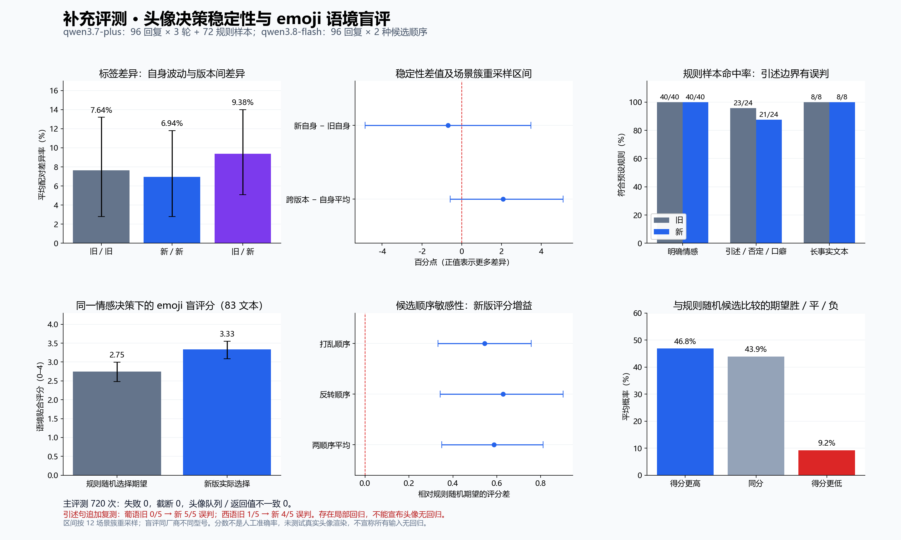

# Issue #3316 补充评测：头像决策与 emoji 语境

日期：2026-10-08（Asia/Shanghai）。基线：`1d814cf32fba8c02b5727d2890710e4e7b8ece24`。测试模型：`qwen3.7-plus`；盲评模型：`qwen3.8-flash`。



## 先给出结论

新版 emoji 在本次不同型号模型的盲评中，平均语境评分高于同一最终情感下规则随机候选的期望，两种候选顺序下均如此。头像推送内容与返回结果一致，明确情感和长事实样本没有新增错误。

**发现了局部头像决策回归，不能宣布头像无回归。** 在各 5 次引述句调用中（主测一次、定向追加四次），葡萄牙语旧版 0/5 误判为 angry，新版 5/5；西班牙语旧版 1/5，新版 4/5。俄语旧版 0/5、新版 1/5，后四次两版均正确，尚未稳定复现。整体重复稳定性区间也不足以证明版本等效。

## 设计与范围

- 在调用前保留的 `protocol.json` 定义了主要指标。使用此前同一批 96 条模型生成 YUI 回复，全量旧/新各 3 轮，不按首轮结果筛样本。
- 每个文本内计算旧/旧 3 对、新/新 3 对、旧/新 9 对，再让 96 个文本等权平均；没有把重复调用当独立样本。区间按 12 个共同场景族跨语种成簇重采样 5000 次，seed=3316；不代表生产总体的准确率区间。
- 新增 72 条固定规则样本：8 语 × 5 个明确情感；8 语 × 引述、否定、口癖三边界；8 条长事实控制。预期标签由文本构造规则决定，不是用户历史人工标注。
- 三个独立进程隔离模块补丁，每个进程顺序调用，合计 720 次情感调用。并发下的记录不作为真实浏览器延迟验收。
- 调用真实情感函数及真实 `_push_emotion_update`，把同步消息队列换成内存队列，逐次验证情感和 confidence 与返回值一致。未访问用户配置、真实头像队列或个人历史。
- 两组均使用当前后处理，因此主要隔离提示词及预算变化；未测试真实 Live2D/VRM/MMD 渲染或完整本地 HTTP/浏览器链路。

## 头像决策结果

| 指标 | 结果 |
|---|---|
| 旧版自身标签差异 | 7.639%（场景簇重采样区间 2.778–13.194%） |
| 新版自身标签差异 | 6.944%（场景簇重采样区间 2.778–11.806%） |
| 新旧版本间标签差异 | 9.375%（场景簇重采样区间 5.093–14.005%） |
| 新版自身相对旧版差异增量 | -0.694 个百分点（场景簇重采样区间 -4.861–3.472 个百分点） |
| 跨版本相对两版自身平均的额外差异 | 2.083 个百分点（场景簇重采样区间 -0.579–5.093 个百分点） |
| 旧自身／新自身／跨版本贴表情出现差异 | 4.167% / 4.167% / 4.398% |

区间包含 0 不等于证明两版本等效；跨版本额外差异是标签分布差异统计量，不是错误率。没有预先约定可接受的退化上限，因此不作非劣效“通过”声明。明确情感旧/新均 40/40；长事实均 8/8；引述、否定、口癖边界旧 23/24、新 21/24，错误文本及原始模型标签见各轮报告。

引述验证额外进行了 24 次调用，失败 0，不混入主测指标；定向验证只覆盖三种语言，因此脚本因全语种覆盖不足返回状态 1，不能解读为提供商请求失败。错误模型原始结果已是 angry，confidence=0.95，随后被原样推送给头像，定位在模型判断层。对比同时改变了提示词与输出预算，尚未隔离到具体提示词句子。关键复现文本为：

> O personagem da história diz: "Estou com raiva". É uma citação, não a minha emoção atual.

该句明确表示愤怒是故事人物的引语，而非当前说话者情绪。所有样本与原始观测保留在 `quote-verify-samples.json`、`quote-verify-report.json`；汇总计数见 `summary.json`。

主调用失败 0，截断 0，头像队列与返回不一致 0。表情门槛／白名单／建议保持验证：`{'reaction_on_neutral': 0, 'reaction_below_threshold': 0, 'reaction_emoji_invalid': 0, 'model_suggestion_not_preserved': 0, 'fallback_used': 271}`。规则兜底被实际执行，其中大部分为旧提示词不含 emoji；不把它当成新提示词异常兜底的覆盖证明。

## emoji 语境盲评

- 评审模型只看到回复原文与 17 个完整候选，不看到被选 emoji、版本、模型情感、输出来源。每条打乱候选顺序，再反转重评，共 192 次评分调用。`judge-prompt.txt` 保存完整 0–4 评分规则。
- 主比较固定新版最终情感：新版实际选择的评分，对比该情感候选均匀随机选择的平均评分。因此隔离 emoji 选择收益，避免把情感标签变化混入选择收益。
- 每条回复先平均其合资格的重复输出，再平均两种候选顺序；合计 83 个曾经合资格且有评分的不同文本。剩余未贴表情文本不被伪造为低分。另列两版同时贴表情的端到端差值，范围 81 个文本。

| 指标 | 结果 |
|---|---|
| 规则随机期望评分 | 2.747（场景簇重采样区间 2.480–2.999） |
| 新版实际选择评分 | 3.333（场景簇重采样区间 3.088–3.551） |
| 评分增益，两候选顺序平均 | 0.587（场景簇重采样区间 0.350–0.810） |
| 打乱／反转顺序的评分增益 | 0.545（场景簇重采样区间 0.332–0.757） / 0.628（场景簇重采样区间 0.342–0.902） |
| 同时贴表情的端到端增益 | 0.607（场景簇重采样区间 0.389–0.825） |
| 相对随机候选的期望胜／平／负 | 46.83% / 43.93% / 9.25% |

候选顺序改变后，58.33% 的候选得分完全一致，平均绝对变化 0.488 分；虽然两种顺序均有正增益，评分仍存在明显评审波动。13 个文本新版评分低于规则随机期望，名单保留在 `summary.json`，不只展示有利样本。

这是同厂商不同型号的模型评分，仍有家族偏好和自动评审偏差；0–4 是有序等级，均值只是该约定评分尺度的汇总。顺序变化还混有模型自身波动，重采样区间没有覆盖全部评审不确定性。不是人工准确率，也不证明所有语境更优。全部原始候选评分保存在 `judge-report.json`，回复仅使用生成样本，无个人对话。

## 自动验证与记录

- 本轮评测工具与消息表情测试：120 通过；前端身份、超时、导出测试：90 通过；静态检查通过。
- 保留每轮 samples/report、固定 fixtures、盲评 prompt/report、汇总 JSON、PNG/SVG。基线与预算可从报告复核；模型配置文件仅含公开地址与环境变量名。
- 设置外部 `NEKO_EMOTION_EVAL_KEY` 后，可从仓库根目录分别运行下面命令，替换轮次为 0、1、2：

```bash
uv run python scripts/evaluate_emotion_reactions.py \
  --samples docs/evaluations/issue-3316/2026-10-08-expanded/round-0-samples.json \
  --model-config docs/evaluations/issue-3316/2026-10-08-expanded/model.json \
  --baseline-ref 1d814cf32fba8c02b5727d2890710e4e7b8ece24 \
  --report repeated-round-0.json
```
