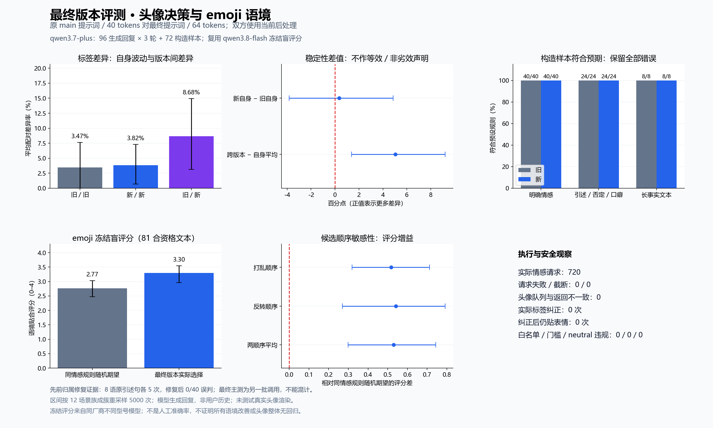

# Issue #3316 最终版本评测

日期：2026-10-08（Asia/Shanghai）。情感模型 qwen3.7-plus；冻结盲评模型 qwen3.8-flash。



## 对照范围和复现

基线是原改动之前 main 的 `1d814cf32fba8c02b5727d2890710e4e7b8ece24`：旧提示词、40 token；新版使用最终提示词、64 token。双方**都使用最终代码的当前后处理**，不把旧列当成完整历史 main 的端到端结果；后处理与资格门控的行为由单元测试验证。

使用既有同一批 96 条模型生成角色回复，每条旧/新各三轮，另加原 72 条构造样本，每条旧/新一次，共 720 次真实模型请求。八语 zh、zh-TW、en、ja、ko、ru、es、pt 均覆盖，生成回复每语种 12 条。构造预期由文本规则决定，不需用户人工标注。**这些是模型生成回复和构造样本，不是生产历史对话；issue 的真实陪伴回复验收不能据此宣称完成。**

三个独立进程、各自顺序调用并交替旧/新顺序；并发运行的延迟不能作为真实前端超时验收。所有样本/观测保留，无按最终结果筛样本。真实 `_push_emotion_update` 写入内存队列；未调用真实用户头像队列、未测试浏览器或 Live2D/VRM/MMD/PNGTuber 渲染。

外部设置 `NEKO_EMOTION_EVAL_KEY` 后，从仓库根目录执行，轮次换成 0、1、2。供应商随机性意味着重跑不会逐字复现数值。报告文件名勿覆盖已保存记录。

```bash
uv run python scripts/evaluate_emotion_reactions.py \
  --samples docs/evaluations/issue-3316/2026-10-08-final/round-0-samples.json \
  --model-config docs/evaluations/issue-3316/2026-10-08-final/model.json \
  --baseline-ref 1d814cf32fba8c02b5727d2890710e4e7b8ece24 \
  --report repeated-final-round-0.json
```

`protocol.json` 保存调用前协议；`provenance.json` 保存最终生产文件指纹；`summary.json` 保存聚合指标、全部错误、逐文本数据和原始 JSON SHA256。配置仅含公开模型名、地址和环境变量名。

## 头像决策稳定性

每个文本内计算旧/旧 3 对、新/新 3 对、旧/新 9 对，再让 96 文本等权平均。配对置信度变化使用三轮对应旧/新差值先在文本内平均。区间按共同 12 场景族跨八语成簇重采样 5000 次，seed=3316；重复调用不是独立新样本。

| 指标 | 均值（场景簇重采样 95% 区间） |
|---|---|
| 旧自身标签差异 | 3.472%（0.000–7.639） |
| 新自身标签差异 | 3.819%（0.694–7.292） |
| 新旧版本间标签差异 | 8.681%（3.125–14.931） |
| 新自身减旧自身 | 0.347 个百分点（-3.819–4.861） |
| 跨版本减两版自身平均 | 5.035 个百分点（1.389–9.201） |
| 配对平均 confidence 变化（新减旧） | 0.004（-0.004–0.013） |
| 旧自身／新自身／跨版本平均 confidence 绝对差 | 0.0188 / 0.0150 / 0.0203 |
| 旧自身／新自身／跨版本贴表情出现差异 | 2.083% / 4.167% / 3.588% |

标签差异不是准确率；跨版本额外差异是标签分布统计量，不是错误率。没有预设非劣效界限，区间包含 0 不等于等效。不能宣布头像整体无回归。

| 构造类别 | 原 main 提示词 | 最终提示词 |
|---|---:|---:|
| explicit_rule_anchor | 40/40 | 40/40 |
| long_factual_control | 8/8 | 8/8 |
| rule_boundary | 24/24 | 24/24 |

全部错误保存在 `summary.json` 的 `rule_fixtures.*.old/new.misses`，不只保留有利结果。

## 引述归属修复证据与资格门控

之前 `2026-10-08-fix` 进行了八语原引述句各五次；修复后误判 0/40，修复前分支提示词共 9/40。该次基线 `688bab7d23299b21093cddf23d2ddcefc88e0e7f`，双方使用当时修复后的后处理和 64 token，仅比较归属提示词。该阶段尚无此次最终 heuristic 资格门控，不可把 480 次历史请求计入本次 720 次。精确源文件指纹以及每语种计数保存在 `summary.json.prior_ownership_evidence`；原记录的 provenance、part-report 保留于原目录。

最终代码规定四类关键词纠正及降级仅影响头像，消息表情需最终决定来自合法模型原始输出；缺失/非法 emoji 可在资格满足时使用原有规则候选。最终自动测试覆盖坏输出、四类 heuristic 纠正、neutral、门槛、白名单与推送。

本次真实调用实际原始/最终标签变化 0 次，纠正后贴表情 0 次。坏/缺失原始输出实际 0 次；规则 emoji 兜底 274 次。未实际触发的降级路径不能算作真实模型覆盖，主要由端点单测验证。报告未直接保存内部 decision_source，标签变更是实际纠正的可观察子集。

## emoji 冻结盲评分

复用 `2026-10-08-expanded/judge-report.json` 的全部 96 文本 × 两种候选顺序评分，不新增评审请求。原评审只见回复和完整 17 候选，不见版本、被选 emoji、情感标签或来源；采用打乱/反转顺序。评分尺度为 0–4 有序等级，非人工准确率。

固定最终新版同一情感决策：实际选择的分数，比较该情感旧规则候选均匀随机的平均分。每个文本先平均合资格重复输出，再平均两种候选顺序，最后文本等权。合计 81 不同文本、234 有表情观测；没有表情的文本不伪造为低分。区间仍按场景族成簇重采样。

| 指标 | 均值（场景簇重采样 95% 区间） |
|---|---|
| 同情感规则随机期望 | 2.766（2.469–3.031） |
| 最终实际选择 | 3.295（2.963–3.550） |
| 两顺序平均评分增益 | 0.530（0.299–0.744） |
| 打乱顺序增益 | 0.517（0.319–0.712） |
| 反转顺序增益 | 0.542（0.270–0.791） |

有 14 个文本增益为负，名单全部保存于 summary。候选两次得分完全一致率 58.33%，平均绝对变化 0.488 分，含候选顺序与评审模型自身波动。评审来自同厂商不同型号，仍有家族偏好；区间不覆盖全部评审不确定性。不推断所有语境更优。

## 执行验证

720 次情感请求：失败 0；截断 0；头像队列与返回不一致 0。neutral／低门槛／非法 emoji／合法建议未保持违规分别为 0 / 0 / 0 / 0。

最终相关自动测试 1091 通过、1 跳过。 静态与前端检查的具体结果以 PR 的 Testing 一节为准。所有统计保持 review_required，不自动判定回归通过。
