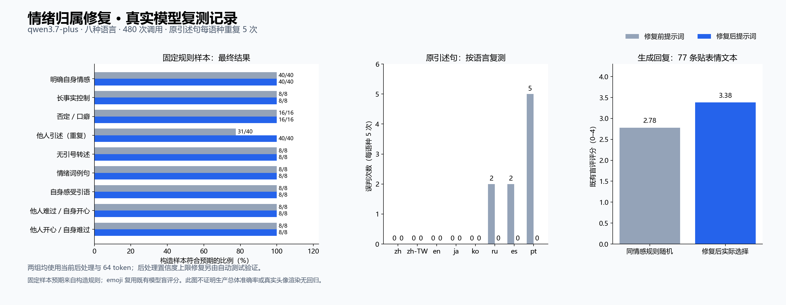

# Issue #3316 情绪归属修复复测

日期：2026-10-08。真实情感模型：qwen3.7-plus，temperature=0.3。



## 修改与验收范围

八种语言统一分析回复说话者自身的外显情绪，先区分他人情绪、转述、台词和例句，再选最强自身情绪。保留自身引语及角色对他人的真实情绪反应；明确 neutral 可以高置信度。没有删除正文、增加模型调用或更改 emoji 白名单/阈值。

关键词 sad-over-happy 覆盖补上 confidence < 0.8，与已有一般强覆盖上限一致。真实关键词扫描的反例在 0.8/0.95/1.0 保留正确 happy；0.6/0.79 继续允许原有不确定结果纠正。这一上限不是完整情绪归属解析器：低置信度或坏输出的关键词降级仍可能误认他人情绪，不能宣称所有引述路径保证正确。

## 对照方法

基线为修复前分支 HEAD `688bab7d23299b21093cddf23d2ddcefc88e0e7f` 的提示词。两组**均使用修复后的后处理和 64 token**，因此真实 A/B 只隔离提示词；后处理上限变化由上述端点测试单独验证。不得把旧列当成完整旧版执行结果。

预先保留 `protocol.json`；八语言 112 条不同构造样本，其中原引述每语种重复五次，合计 144 条构造观测；另用同一批 96 条生成回复单次复测。三个独立进程分组、交替旧/新调用顺序，合计 480 次请求。无个人对话、无人工标注负担。重复调用不等于新增独立样本。

调用真实端点和 `_push_emotion_update`，只把头像队列替换为内存队列。未测试真实浏览器、Live2D/VRM/MMD/PNGTuber 渲染。

## 构造样本结果

修复前提示词符合预期 135/144；修复后 144/144。两组都是当前后处理。

| 类别 | 修复前提示词 | 修复后提示词 |
|---|---:|---:|
| 明确自身情感 | 40/40 | 40/40 |
| 长事实控制 | 8/8 | 8/8 |
| 否定／口癖 | 16/16 | 16/16 |
| 他人引述（重复） | 31/40 | 40/40 |
| 无引号转述 | 8/8 | 8/8 |
| 情绪词例句 | 8/8 | 8/8 |
| 自身感受引语 | 8/8 | 8/8 |
| 他人难过／自身开心 | 8/8 | 8/8 |
| 他人开心／自身难过 | 8/8 | 8/8 |

原引述句误判次数如下，均为每语种五次，不与前次定向复测的调用混计：

| 语言 | 修复前误判 | 修复后误判 |
|---|---:|---:|
| zh | 0/5 | 0/5 |
| zh-TW | 0/5 | 0/5 |
| en | 0/5 | 0/5 |
| ja | 0/5 | 0/5 |
| ko | 0/5 | 0/5 |
| ru | 2/5 | 0/5 |
| es | 2/5 | 0/5 |
| pt | 5/5 | 0/5 |

修复后不符合预期的构造观测：`[]`。

原始模型判断正确、被后处理改错的观测保存于 `summary.json` 的 `raw_correct_final_wrong`，所有原始标签、置信度、最终结果和队列结果保存在各 part-report。

## 生成回复与 emoji

96 条生成回复旧/新最终标签一致率 91.67%；贴表情出现变化 5 条。这是一轮对照，不是准确率或充分稳定性证明。

复用此前 `../2026-10-08-expanded/judge-report.json` 中对相同 96 文本、完整 17 候选的两种顺序盲评分，不重新挑评审文本或重新调用评审模型。修复后 77 条有实际表情的文本，选择评分均值 3.383，同一最终情感规则随机候选期望 2.781，增益 0.602。同厂商不同型号评审的偏差和波动仍适用；不推断所有语境改善。

## 验证、记录及复现

请求失败 0；截断旧/新 0/0；队列与返回不一致旧/新 0/0。相关自动测试 1041 通过、1 跳过；Ruff 和差异格式检查通过。

保留 samples/report、protocol/provenance、summary、PNG/SVG。配置仅含公开 URL、型号和环境变量名。外部设置 `NEKO_EMOTION_EVAL_KEY` 后，从仓库根目录运行（part 改为 0/1/2）：

```bash
uv run python scripts/evaluate_emotion_reactions.py \
  --samples docs/evaluations/issue-3316/2026-10-08-fix/part-0-samples.json \
  --model-config docs/evaluations/issue-3316/2026-10-08-fix/model.json \
  --baseline-ref 688bab7d23299b21093cddf23d2ddcefc88e0e7f \
  --report repeated-fix-part-0.json
```
