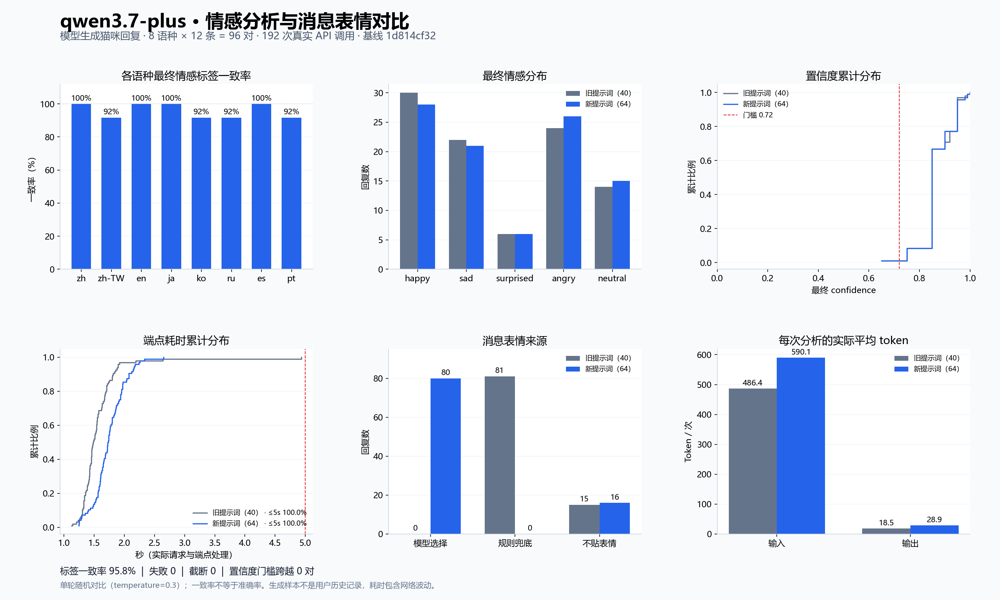

# Issue #3316 情感与表情对比记录

日期：2026-10-08（Asia/Shanghai）。模型：`qwen3.7-plus`；服务：百炼北京官方接口。



## 方法与样本来源

- 基线：`1d814cf32fba8c02b5727d2890710e4e7b8ece24`，旧预算 40；当前生产提示词预算 64。
- 两组使用相同的当前端点后处理、temperature=0.3、timeout=30s，同一条回复各调用一次；每条交替旧/新先后顺序。
- 96 条回复由模型按仓库八语角色提示词与 YUI 角色卡生成，每语种 12 条。不是用户历史记录，也没有人工情感标注。
- 场景：庆祝、亲近、丧失安慰、离别、意外归来、意外礼物、愤怒边界、不公平、普通事实、否定、引述情绪、混合语气。
- 这是一次真实 API 对比；一致率衡量稳定性，不证明准确率，也没有自动判定“通过”。

## 结果

- 最终标签一致率：95.83%；有效对数：96；失败调用：0；截断：0。
- 最终 confidence 跨越 0.72 门槛：0 对。
- 旧/新平均 confidence：0.8712 / 0.8704。
- 旧/新平均端点耗时：1.568s / 1.748s。
- 旧/新 P95 端点耗时：1.895s / 2.171s。
- 旧/新 5 秒内完成：96/96 / 96/96。
- 新表情来源：{'model': 80, 'rule': 0, 'none': 16}。

耗时包含本机网络和提供商波动；5 秒对应前端等待窗口，未执行真实浏览器端到端计时。单次模型调用具有随机性，标签差异需要结合记录解释，不能直接视作准确率下降。

## 保留文件与复现

`report.json` 保存逐条脱敏观测，`samples.json` 保存生成回复，`provenance.json` 保存来源与文件指纹，`runtime-summary.json` 保存耗时统计。`model.json` 仅包含公开配置及环境变量名，不含密钥。`comparison.png` 可用于 PR 描述，`comparison.svg` 为矢量版本。

在外部设置 `NEKO_EMOTION_EVAL_KEY` 后，从仓库根目录运行：

```bash
uv run python scripts/evaluate_emotion_reactions.py \
  --samples docs/evaluations/issue-3316/2026-10-08/samples.json \
  --model-config docs/evaluations/issue-3316/2026-10-08/model.json \
  --baseline-ref 1d814cf32fba8c02b5727d2890710e4e7b8ece24 \
  --report new-emotion-report.json
```

## 首轮差异的定向复测

对首轮 4 条标签不同的回复各追加 3 组旧/新调用，共 24 次调用；失败调用 0。下表包含首轮及复测，每个版本每条回复共 4 次。

| 回复场景 | 旧提示词标签计数 | 新提示词标签计数 |
|---|---|---|
| zh-TW:unexpected_return | happy: 4 | sad: 1, happy: 3 |
| ko:boundary_anger | sad: 3, angry: 1 | angry: 1, sad: 3 |
| ru:mixed_tone | sad: 3, angry: 1 | angry: 2, sad: 2 |
| pt:quoted_emotion | happy: 3, neutral: 1 | neutral: 4 |

繁中、韩语与俄语在复测中出现标签差异消失或反向，旧版本自身也有波动。葡萄牙语引述句的新版本 4 次均为 neutral，旧版本为 happy 3 次、neutral 1 次；该文本明确解释愤怒是故事角色的引语，不是当前说话者情绪，neutral 与既有转述规则一致。这是具体文本的规则解释，不是人工准确率标注，也不能据此断言整体准确率提高或完全不回归。

`repeat-report.json` 和 `repeat-samples.json` 保存定向复测记录。定向复测仅覆盖出现差异的 4 种语言，因此脚本按缺少全语种覆盖返回状态 1；报告中的失败调用为 0。首轮八语评测返回状态 0，两份报告均保持 review_required，未自动宣布回归通过。图中 95.8% 是首轮 96 对的结果，未混入筛选后的复测样本。
