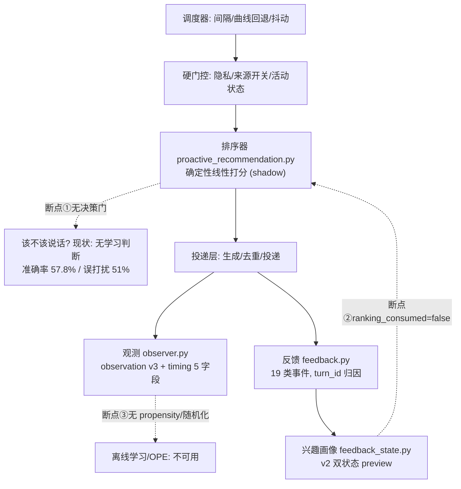
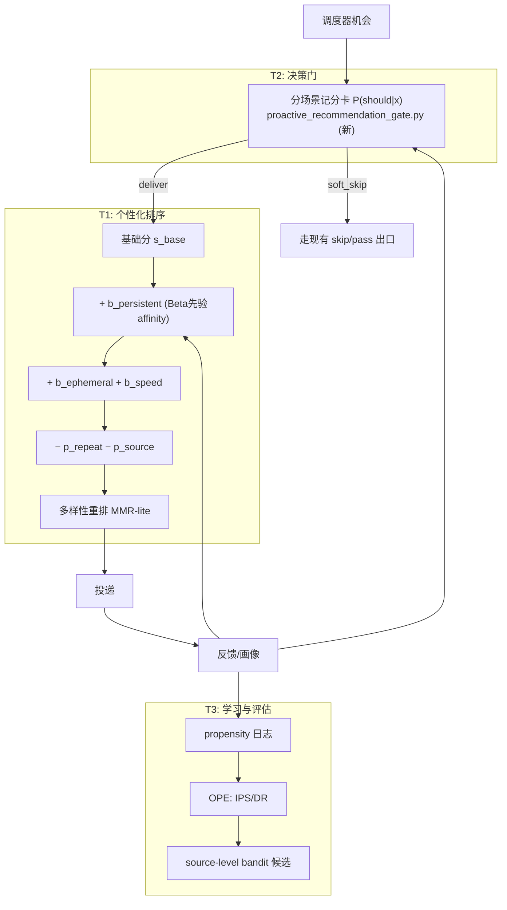

# 推荐系统深度技术路线:从影子系统到"会决策、懂个性、可放量"

> 日期:2026-07-26 | 性质:**工程化技术路线提案**(每个版本进入实现前仍需按项目规矩立项)
> 与既有文档的关系:
> [`proactive-recommendation-academic-technical-route.md`](../design/proactive-recommendation-academic-technical-route.md)(下称"学术路线")是**研究依据库**——本文公式凡标 §4.x 均引自其中的研究候选;
> [`proactive-recommendation-current-scope.md`](../design/proactive-recommendation-current-scope.md) 是当前授权边界;
> [技术路线(索引版)](./recommendation-technical-route-2026-07-26.md) 是排期层。本文回答"**技术上怎么把能力做出来**"。

---

## 1. 现状技术底座(2026-07-26 实测基线)

### 1.1 数据流现状与三个断点

- **断点①**:排序器只答"哪个候选好",没有模块回答"现在该不该说"——调度器是固定规则,不看用户反应;
- **断点②**:`feedback_state.py` 的画像从不回流进 `proactive_recommendation.py` 的打分(`ranking_consumed=False` 硬编码);
- **断点③**:确定性策略 `propensity≡1.0`,没有反事实支持,任何离线策略学习(OPE/bandit)在数学上不可用(学术路线 §4.11)。

### 1.2 现有信号与参数资产(全部已实现、经单测)

| 资产 | 位置 | 现值/语义 |
|---|---|---|
| 排序基础分 + 来源权重 | `main_logic/proactive_recommendation.py` | 线性可解释,`score_breakdown` 全记录;news 权重含 -0.05 影子校准 |
| timing v3 五字段 | `proactive_recommendation_timing.py` + observer | 基础间隔/实际间隔/30m 计数/2h 计数/连续未回应;只读 |
| 19 类反馈事件 | `proactive_recommendation_feedback.py` `_FEEDBACK_EVENT_SCORES` | 例:`user_reply` +0.15、`user_continue` +0.35;`REPLY_FAST_SECONDS=60` |
| reward_score_v2 preview | 同上 | `clip(reply+continue+consumption+relative_speed−interrupt−settings, −1, 1)`(§4.7) |
| 个人相对回复速度 | 同上(G0-B) | `log(1+latency)` 中位数+MAD 基线,≥5 次回复激活,bonus ≤ +0.05(§4.5) |
| v2 兴趣画像 | `proactive_recommendation_feedback_state.py` | 会话接受度/来源亲和度双状态;临时桶 TTL 2h;持久桶 ≥3 条显式证据;**affinity 达门槛即阶跃至 ±0.2** |
| 个性化模拟结论 | testbench R1/R2 | delta=affinity×0.03 硬裁剪 ±0.03;`gradual_12` 置信曲线过机械门禁 |
| 调参层 | `proactive_recommendation_tuning.py` | 来源调整钳制 ±0.15;auto_safe 含步长/冷却/回滚/健康暂停(默认 off) |
| 护栏 | 排序器 + testbench evaluator | HHI、最大来源曝光、`ACTIVE_MIN_SCORE_GAP=0.05` |
| 运行时开关 | `proactive_recommendation_runtime.py` | 单向 active→shadow 回退,带锁与原因记录 |

**结论:三条能力线所需的信号、护栏、回退机制全部就位,缺的是"消费"与"学习"。**

---

## 2. 终态目标架构

对应学术路线 §4.4 总公式,每一项独立评估、独立 flag、全进 `score_breakdown`:

> s(c,t) = s_base + s_time + b_persistent + b_ephemeral + b_feedback − p_repeat − p_source − p_risk

---

## 3. 路线 T1:个性化(断点②的四个版本)

### T1.1 有界确定性消费(第一个真正的个性化)

**公式**(R2 已离线验证的 `gradual_12`):
`delta(u,s) = clip( sign(affinity_{u,s}) · min(1, evidence_{u,s}/12) · 0.03, −0.03, +0.03 )`,证据数 < 3 时 delta=0。

**改动**:`proactive_recommendation.py` 打分链新增 personalization component(读决策前快照,不读实时状态,保证 point-in-time);`config/proactive_settings.py` 新开关 `PERSONALIZATION_MODE=off/shadow_compare/active`;observer 记录 baseline vs personalized 双排序。

**前置**:负向证据存在(T0 负反馈入口,见 §6)且 R3 验收通过(方向校准:负证据必须产生负 delta)。

**完成后效果**:opt-in 用户的音乐类偏好开始温和影响投递(±0.03 幅度只在近分差场景翻转);每条投递可解释("因为你最近听完了 3 首推荐曲目 +0.021");`off` 下与现状逐位一致。
**局限(诚实)**:R2 已证明当前分差分布下 Top-1 翻转≈0——此版价值是**打通消费链路**,不是显著改变行为。

### T1.2 Beta 先验 + 半衰期衰减(平滑且可遗忘的兴趣)

**公式**(学术路线 §4.6 稳定兴趣):
`affinity_{u,s} = (α₀+pos_{u,s})/(α₀+β₀+pos_{u,s}+neg_{u,s})`,映射到 [−1,1] 用 `2·affinity−1`;读写时按半衰期 H 衰减证据 `evidence ← evidence · 2^(−Δt/H)`。起评参数:α₀=β₀=1,H=14 天(music)/30 天(web 类)——与现有遗忘注释(music≈4.5d、web≈13d)对齐后统一评审。

**替换什么**:现状"≥3 条证据即阶跃到固定 ±0.2"的不连续行为 → 连续、双向、自动遗忘。
**改动**:`feedback_state.py`(核心公式与衰减)、删除入口 `POST /recommendation/state/reset`(`proactive_router.py`)、testbench `recommendation_bounded_personalization.py` 同步对照两版公式。

**完成后效果**:一时兴趣不再"定终身";停止听音乐几周后音乐偏好自动淡出;负反馈立即压低方向而非等正证据稀释;画像可一键删除——**个性化获得治理完整性,放量的隐私前提成立**。

### T1.3 会话内信号与温和多样性

- 消费临时桶(§4.6 临时状态):同会话内的正反馈给 `b_ephemeral`(上限 +0.02,TTL 2h 已有);
- 消费个人回复速度 preview(§4.5,`b_speed = 0.05·sigmoid(z_speed)`,已实现只差接线);
- 重复/单候选恢复(§4.8):semantic repeat 软惩罚 + 唯一安全候选的有上限 recovery bonus;
- MMR-lite(§4.9):候选 ≤ 十几个,`sim` 用五个布尔可审计项,无向量库。

**完成后效果**:"刚聊过音乐就更愿意继续音乐"的会话内跟随;慢性子用户不再被 60 秒线误伤;重复素材骚扰下降,冷来源不至于永久饿死。

### T1.4 上下文化与探索(远期,学术路线 §4.10)

source-level arms(music/news/video/meme/vision)+ LinUCB/LinTS(MABWiser),reward=`reward_score_v2`。
**硬前置**:≥500 条可归因反馈、安全随机化获批产生非退化 propensity、OPE 验证通过、用户 opt-in。此前一律 HOLD——确定性策略下任何 bandit 评估在数学上无效(§4.11)。

---

## 4. 路线 T2:决策门(断点①的四个版本)

### T2.1 标签与特征基建

**标签**:标注轮(101 条)+ 多用户 cohort 追加标注;标签定义沿用 R0 协议(`should_recommend` + 置信度,盲于结果字段)。
**特征向量 x**(全部 point-in-time,契约:不得使用该 observation 之后的任何信息):

| 特征 | 来源 | 变换 |
|---|---|---|
| activity 状态 | `activity_snapshot.state` | one-hot(idle/chatting/focused_work/…) |
| timing 五字段 | observation v3 | `log(1+·)` 数值 + 计数原值 |
| interval_ratio | elapsed/configured | 连续值(仅特征,不做调度语义) |
| 个人回复速度 z | G0-B 基线 | z_speed |
| 会话接受度 | v2 conversation_acceptance 快照 | 温和度分 |
| 连续未回应数 | timing 字段 | 原值(疲劳代理) |
| 可用安全候选数/最高候选分 | 排序器输出 | 候选质量代理 |

新建 `tests/testbench/pipeline/recommendation_gate_dataset.py` 组装。

### T2.2 分场景可解释记分卡

**形式**:每个 activity 场景一个 `P(should|x)=σ(wₐ·x)`——**不是统一阈值**(F1 已否定),是分场景函数;样本不足的场景不建模、保持现状。
**拟合**:纯 numpy 手写 IRLS 或固定迭代次数/固定初始化的梯度下降 + L2(λ 网格),完全确定性可复现,无新运行时依赖(家规)。可选单调性约束(如"连续未回应数↑ ⇒ P↓")保证可解释。
**评估**(学术路线 §5.5/§5.6 统计纪律):时间切分 + leave-one-source-out + 确定性 bootstrap CI + 可靠性曲线(校准);验收线**先定后跑**:留出集误打扰 <25% 且 missed opportunity 不劣于现状。
**落点**:新建 `main_logic/proactive_recommendation_gate.py`(先仅被 testbench 引用)+ `recommendation_gate_eval.py` + 新烟测。

### T2.3 生产消费(gate 的三档接入)

`GATE_MODE=off/shadow/active`(`config/proactive_settings.py`):

- `shadow`:每轮机会记录 `gate_score` 与假想动作进 observation,零行为影响——先积累"假想打扰减少量"的回放证据;
- `active`(opt-in):`P(should) < 场景阈值` → 输出 `soft_skip` 建议,由 `proactive_chat_flow.py` **现有** skip/pass 出口消费(不新增第二套调度,§4.3 约束);
- **防饿死熔断**:连续 K 次 soft_skip 强制放行一次;每日 skip 预算上限;gate 异常一律 fail-open(放行)并降级日志——打扰是烦恼,永远沉默是事故;
- 复用 `proactive_recommendation_runtime.py` 的单向回退模式:active→shadow 一键降级。

**完成后效果**:**全路线中用户感知最强的一步**——不合时宜的搭话显著减少(验收线误打扰 <25%,较现状 51% 几乎腰斩),focused_work 时段安静、idle 时段正常;每次 skip 都带可解释的记分卡明细。

### T2.4 疲劳/序列扩展(远期)

per-user 疲劳分(指数恢复,学术路线 §4.2 保留的研究假设)、时段先验、多步序列特征——仅当 T2.2 残差分析显示这些信号有增量时立项。

---

## 5. 路线 T3:产品化成熟度

### T3.1 模式开关矩阵(全部默认最保守档)

| 开关 | 档位 | 语义 |
|---|---|---|
| `PROACTIVE_RECOMMENDATION_MODE` | shadow/off/active_source | 既有 |
| `…_PERSONALIZATION_MODE`(新) | off/shadow_compare/active | T1 消费 |
| `…_GATE_MODE`(新) | off/shadow/active | T2 消费 |
| `…_OBSERVATION_LOG`/`…_FEEDBACK_LOG` | off/jsonl | 既有采集 |
| `…_TUNING_MODE` | off/manual/auto_safe | 既有,长期保持 off 直至独立评审 |

组合原则:任一新档位只能叠加在 shadow 验证通过之上;任意异常自动单向回退到左侧更保守档。

### T3.2 可观测性

`GET /api/proactive/recommendation/summary` 扩展四组产品指标:shadow 一致率(personalized vs baseline 排序差异频率)、delta 分布(P50/P90/触顶率)、gate skip 率与熔断触发数、负反馈率。observer 既有 `active_ready`/validation 报表升级为健康门禁数据源。

### T3.3 自动降级(把 tuning 的安全机制推广为通用模式)

`proactive_recommendation_tuning.py` 已有健康暂停/回滚思想 → 抽出通用守护:归因失败率、护栏越界(HHI/曝光)、gate skip 超预算、异常率,任一超阈值 → 对应能力自动降一档并记 observation;恢复只允许人工。

### T3.4 隐私与治理

画像删除入口(T1.2)、留存策略(原始 JSONL 滚动、freeze 永久只读)、propensity 字段进 observation 前的专项隐私评审(§4.11 契约)、`production_release_approved` 翻转的正式评审会——治理是放量的构成部分,不是事后补丁。

### T3.5 性能与规模边界

全链路确定性纯 Python:gate=一次点积+sigmoid,personalization=每候选一次查表+裁剪,单轮开销 O(候选数),微秒级;状态按 `lanlan_name` 隔离(已有);**明确不引入**向量数据库、模型服务、Feature Store(§3.3 可行性边界)。多用户规模瓶颈在数据治理而非算力。

### T3.6 评估体系产品化

CI 挂 14 烟测+推荐单测;Golden 每季度重校(标注漂移检查);Canary 按 §5.8:指标=关闭率/显式负反馈率/搭话回复率,预定样本量与自动回滚线,达标才进"默认开启"评审。

---

## 6. 版本-效果总表(含前置的 T0 数据层)

| 版本 | 内容 | 前置 | 完成后系统效果 | 主要风险 |
|---|---|---|---|---|
| T0a | 负反馈入口(`user_not_interested`) | 立项 | 负例自然积累;行为不变 | 误触噪声(UI 防误触+分层标记) |
| T0b | 标注轮 + 多用户 cohort | 授权+人力 | 标签与外推性;行为不变 | 四格门禁不达标→转多用户采集 |
| T1.1 | 有界确定性个性化消费 | T0a+R3 验收 | 消费链路打通;近分差场景轻微偏好倾斜 | 影响过小(预期内,链路价值) |
| T1.2 | Beta 先验+衰减+删除 | T1.1 | 兴趣平滑、可遗忘、可删除;治理完整 | 参数选择(离线网格+对照) |
| T1.3 | 会话内信号+速度 bonus+重复/恢复+MMR-lite | T1.2 | 会话跟随、慢用户公平、重复骚扰下降 | 项间耦合(单变量逐项评估,§4.4 纪律) |
| T2.2 | 分场景记分卡(离线+shadow) | T0b | gate 假想打扰减少量可回放量化 | 标签量不足→只做 idle/chatting |
| T2.3 | gate 生产消费(opt-in) | T2.2 达线 | **误打扰 51%→<25%,体验质变** | 过度沉默(fail-open+熔断+预算) |
| T1.4 | source-level bandit | ≥500 反馈+随机化批准+OPE | 持续自优化的来源选择 | propensity/伦理评审不过→保持确定性 |
| T3.x | 放量基建 | 伴随各版本 | Canary→默认开启评审资格 | — |

**推荐实施序**:T0a/T0b 并行 → T2.2(shadow)与 T1.1 并行 → T2.3 → T1.2 → T1.3 → T3.6 Canary → (远期)T1.4/T2.4。
决策门先于个性化深化:**减少打扰比推得更准对桌宠体验的边际价值更高**,且它只依赖标签、不依赖负例积累周期。

## 7. 与授权边界的对应

每个版本进入实现 = 一次独立立项(蓝图 + 设计评审 gate,体例照 `P25_BLUEPRINT.md`);本文所有公式在立项前均为研究候选(与学术路线 §4 的免责一致);现有停止点(不改调度职责、不加统一阈值、不提前扩张 observation 契约、不无审批随机化)全程有效。
